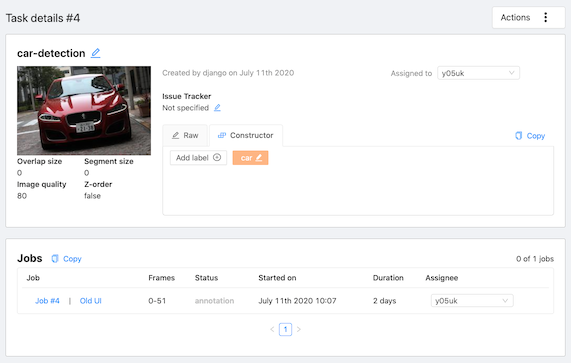
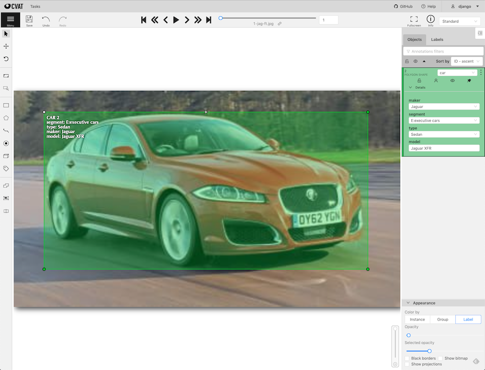
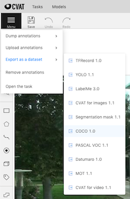
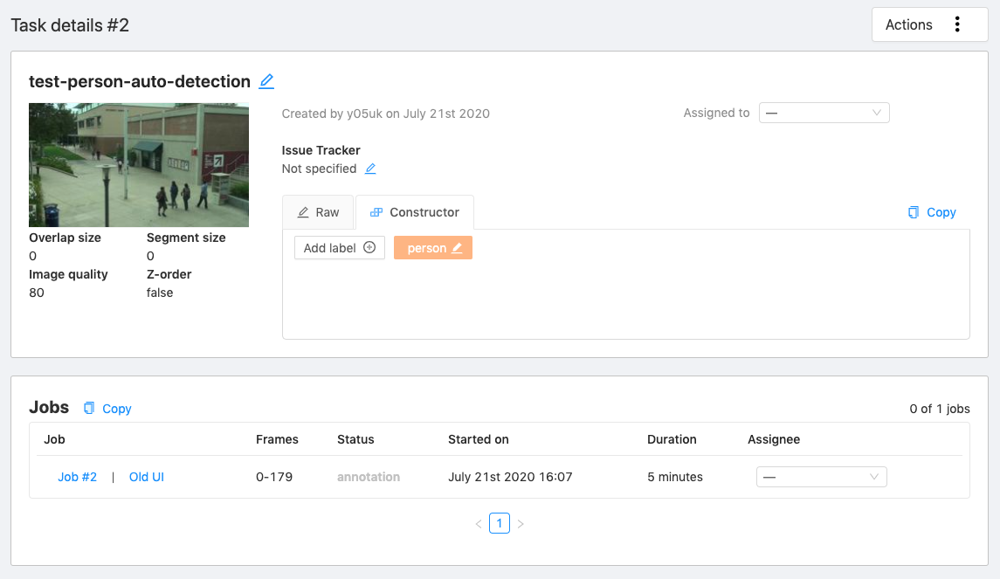
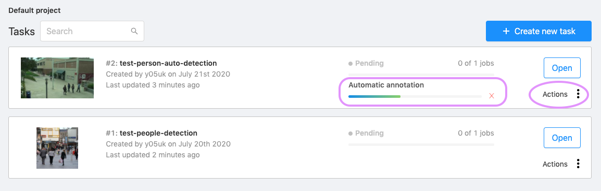
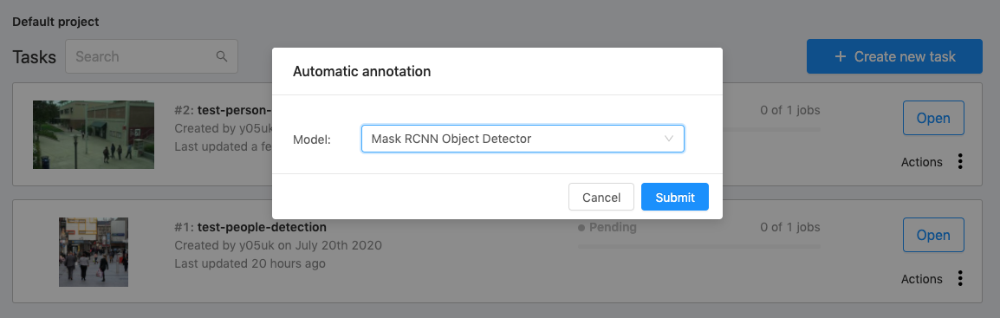
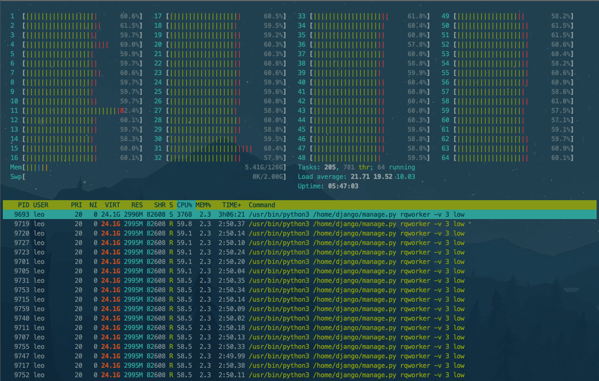
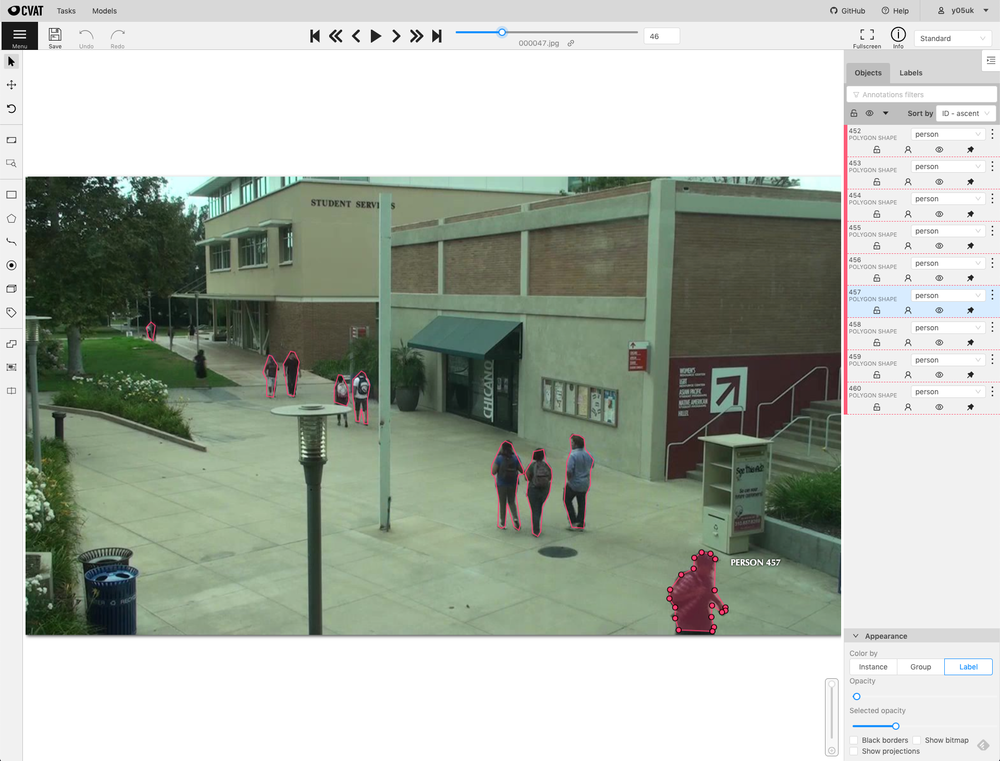
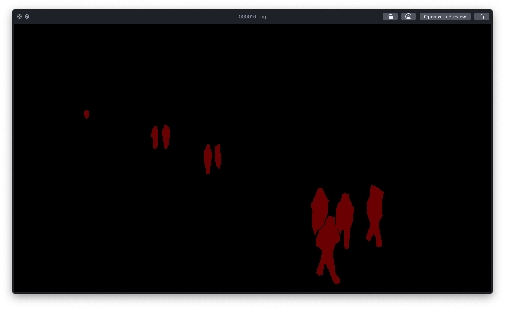
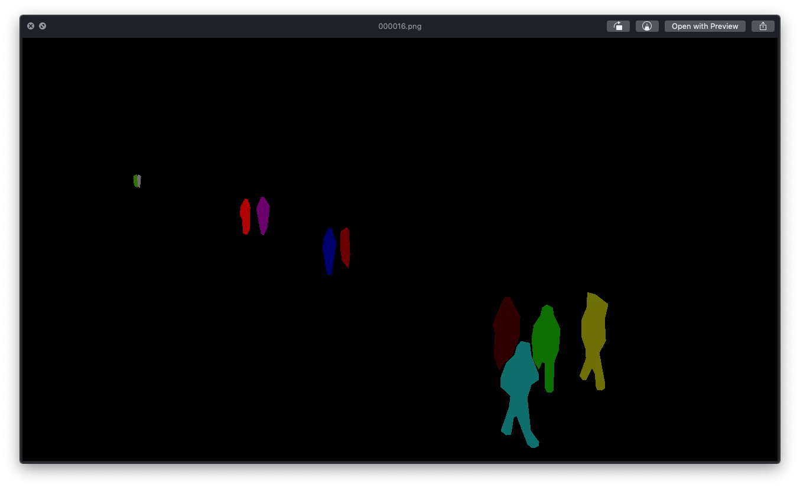

# OpenCV CVAT (アノテーションツール)

* 作成日: 2020/07/13
* 更新日: 2020/07/27

## アノテーションツールの機能要件

画像分析プロジェクトのトレーニング向けに大量に蓄積された画像データに対して、効率的にアノテーションを進めることができるツールが存在するか調査しました。私が定義したアノテーションツールの機能要件は次の通りです。

1. **マルチユーザ** での利用が可能
2. **ブラウザー** で利用することが可能
3. 豊富な出力フォーマットをサポート
4. **自動アノテーション** をサポート

これらの全ての条件を満たすアノテーションツールが <a href="https://github.com/opencv/cvat" target="_blank">OpenCV CVAT</a>です。このツールを発見するまでに多くのツールを調査し、最後まで候補に残ったのが以下のツールです。

### 比較したアノテーションツール

* <a href="https://github.com/microsoft/VoTT" target="_blank">Microsoft VoTT</a>
* <a href="https://cloud.annotations.ai/" target="_blank">IBM Cloud Annotation</a>


## インストール方法

* [公式 Quick installation guide](https://github.com/opencv/cvat/blob/develop/cvat/apps/documentation/installation.md#quick-installation-guide)

### 特徴

* Dockerを利用しCVATの環境を構築することができます
	* `Dockerfile`, `docker-compose.yml` が提供されているので、以下の通りコマンドを実行するだけで `cvat` を起動することができます

```bash
$ git clone https://github.com/opencv/cvat.git
$ cd cvat
$ git checkout v1.0.0
$ git branch -va
* (HEAD detached at v1.0.0)              07de714 Release 1.0.0 (#1335)
  develop                                e372589 Bump lodash from 4.17.15 to 4.17.19 in /cvat-ui (#1913)
  remotes/origin/HEAD                    -> origin/develop
  remotes/origin/az/fix_dextr            9ee7dbd fixed dextr segmentation for grayscale images
  remotes/origin/az/update_pip           ef4bbd2 updated pip version
  remotes/origin/bs/fix_canvas_built     8df6e79 Fixed built
  remotes/origin/develop                 e372589 Bump lodash from 4.17.15 to 4.17.19 in /cvat-ui (#1913)
  remotes/origin/master                  07de714 Release 1.0.0 (#1335)
  remotes/origin/nm/auth_rbac            d819580 Merge remote-tracking branch 'origin/develop' into nm/auth_rbac
  remotes/origin/nm/projects_ui          cd55511 Merge remote-tracking branch 'origin/develop' into nm/projects_ui
  remotes/origin/nm/serverless           f36df30 Deleted outdated migration.
  remotes/origin/nm/serverless_prototype 9dbd7b9 OpenFaaS prototype (dextr.bin and dextr.xml are empty).
  remotes/origin/release-1.1.0           f1b0178 Add release 1.1.0-alpha date.
  remotes/origin/zm/ann-quality-main     9a6817d Merge branch 'develop' into zm/ann-quality-main
  remotes/origin/zm/ann-quality-merge    92504c7 Make merging plugin

$ docker-compose build
.
.
.
$ docker-compose up -d
.
.
.
## ユーザを作成する (http://localhost:8080/ にアクセスするときに必要なアカウントを作成する)
$ docker exec -it cvat bash -ic 'python3 ~/manage.py createsuperuser'
```

冒頭で私が定義したアノテーションツールの機能要件をCVATは全て満たしています。

* **ブラウザー** で利用することが可能
* **マルチユーザ** での利用が可能
	* 事前にユーザの作成と ユーザ権限を設定する必要がある
* 豊富な出力フォーマット
* **自動アノテーション** をサポートしている
	* [Tensorflow物体検出 - RCNN Object Detector](https://github.com/opencv/cvat/blob/develop/components/tf_annotation/README.md)
	* [OpenVINOフォーマットの深層学習による自動アノテーション](https://github.com/opencv/cvat/blob/develop/cvat/apps/auto_annotation/README.md) => 未試行 (2020/07/21現在)
	* [Deep Extreme Cutによる半自動アノテーション](https://github.com/opencv/cvat/blob/develop/cvat/apps/dextr_segmentation/README.md) => 未試行 (2020/07/21現在)

## アノテーション (マニュアル)

マニュアル・アノテーション、オート・アノテーションのいずれの方法を選択したとしても、まず最初にタスクを作成する必要があります。

### タスク作成



* アノテーション対象の画像ファイルを取り込む OR 共有ドライブを指定 OR リモートソースの指定(URL)
* アノテーション (ラベル) の定義
	* ラベル と 属性の定義
* アノテーション情報の設定
	* タスク名
	* Z-order 利用する/しない
	* 画像品質%
	* Dataset repository URL *(Option)*
	* Use LFS (Large File Support) 利用する/しない

#### 利用方法

<iframe width="560" height="315" src="https://www.youtube.com/embed/JERohTFp-NI" frameborder="0" allow="accelerometer; autoplay; encrypted-media; gyroscope; picture-in-picture" allowfullscreen></iframe>

### マニュアル アノテーションの実行

* オブジェクト選択:
	* 矩形
	* ポリゴン
	* ポリライン *(複数線 => ポリゴン)*
	* ポイント
	* Cuboid *(立方体)*
* 操作
	* マージ
	* 分割
	* グループ

タスク作成のステップで "ラベル と 属性の定義" を事前に行うことで オブジェクト選択後、ラベルを選択し、必要があれば属性を設定します *(例えば、"Person" ラベル + 属性 "歩いている", "男性" と設定することができる)*



#### 利用方法 (動画コンテンツ)

<iframe width="560" height="315" src="https://www.youtube.com/embed/vH_639N67HI" frameborder="0" allow="accelerometer; autoplay; encrypted-media; gyroscope; picture-in-picture" allowfullscreen></iframe>

<iframe width="560" height="315" src="https://www.youtube.com/embed/iIkJsOkDzVA" frameborder="0" allow="accelerometer; autoplay; encrypted-media; gyroscope; picture-in-picture" allowfullscreen></iframe>

<iframe width="560" height="315" src="https://www.youtube.com/embed/Hc3oudNuDsY" frameborder="0" allow="accelerometer; autoplay; encrypted-media; gyroscope; picture-in-picture" allowfullscreen></iframe>


### アノテーション情報出力

* アノテーション後、アノテーションファイルをダウンロードする
* アノテーションファイルのフォーマットは以下の通りです
	* COCO 1.0
	* Datamaro 1.0
	* LabelMe 3.0
	* MOT 1.0
	* PASCAL VOC 1.1
	* Segmentation mask 1.1
	*  TFRecord 1.0
	*  YOLO 1.1
*  LabelMe 3.0形式のアノテーションファイルを取り込む (インポート) ことが可能



* メニュー - `Export as a dataset` > `COCO 1.0` を選択することで <a href="https://www.immersivelimit.com/tutorials/create-coco-annotations-from-scratch/#coco-dataset-format" target="_blank">COCO 1.0 フォーマットのデータセット</a>をダウンロードすることができます
* CVATでCOCO 1.0 フォーマットのデータセットの作成に成功すると、自動的にダウンロードが開始され、ファイル名 - `task_test-person-movie-auto-annotation-{DATE_TIME}-coco 1.0` がローカルディスクに保存されます


#### COCO 1.0出力結果
##### ダウンロードファイル

* ダウンロードしたファイルを確認します

```bash
$ ls -l ./task_test-person-movie-auto-annotation-2020_07_21_07_47_19-coco\ 1.0.zip
-rw-r--r--@ 1 yosukehara  staff  63143552 Jul 27 15:14 ./task_test-person-movie-auto-annotation-2020_07_21_07_47_19-coco 1.0.zip
```

##### COCO 1.0フォーマット ファイルの確認

* 次に 正しく COCO 1.0フォーマットのデータセットが作成されているか確認します

```bash
$ unzip task_test-person-movie-auto-annotation-2020_07_21_07_47_19-coco\ 1.0.zip
$ cd task_test-person-movie-auto-annotation-2020_07_21_07_47_19-coco\ 1.0
$ ls -l
total 0
drwxr-xr-x@   3 yosukehara  staff     96 Jul 27 15:15 annotations
drwxr-xr-x@ 586 yosukehara  staff  18752 Jul 27 15:15 images

$ tree
.
├── annotations
│   └── instances_default.json
└── images
    ├── frame_000000.jpg
    ├── frame_000001.jpg
    ├── frame_000002.jpg
    ├── frame_000003.jpg
    .
    .
    .
    ├── frame_000581.jpg
    ├── frame_000582.jpg
    └── frame_000583.jpg
```

* 2つのディレクトリ - `annotations` と `images` が存在します
* `annotations` ディレクトリ内に `instances_default.json` これが <a href="https://www.immersivelimit.com/tutorials/create-coco-annotations-from-scratch/#coco-dataset-format" target="_blank">COCO 1.0 データセット JSONフォーマット</a> ファイルです

```json
$ cat instances_default.json | jq
{
  "categories": [
    {
      "id": 1,
      "supercategory": "",
      "name": "person"
    }
  ],
  "annotations": [
    {
      "id": 1,
      "category_id": 1,
      "iscrowd": 0,
      "area": 684,
      "image_id": 0,
      "segmentation": [
        [
          381,
          332.5,
          377,
          318.5,
          373.5,
          328,
          367.5,
          329,
          368.5,
          306,
          364.5,
          297,
          376,
          272.5,
          383.5,
          290,
          381,
          332.5
        ]
      ],
      "bbox": [
        364.5,
        272.5,
        19,
        60
      ]
    },
    .
    .
    .
    // (繰り返し: 各画像のアノテーション情報)
```

* `images` ディレクトリを確認すると、アノテーションを行なった画像ファイルが存在します
* アノテーション元ファイルが動画ファイルの時、CVATは自動的に 各フレームを画像ファイルに変換します


## 自動アノテーション

**NOTE:** Masterブランチの開発版では動作しないので、 [Tag: v1.0.0](https://github.com/opencv/cvat/tree/v1.0.0) を指定してチェックアウトする必要があります

### Tensorflow Object Detection Auto Annotation

Tensorflow + [Faster RCNN Inception Resnet v2 Atrous Coco Model](https://supervise.ly/explore/models/faster-r-cnn-inception-res-net-v-2-coco-1863/overview) モデルを使った自動アノテーション機能です

#### Dockerイメージ作成

```bash
$ docker-compose \
    -f docker-compose.yml \
    -f components/tf_annotation/docker-compose.tf_annotation.yml build
.
.
.
$ docker images
REPOSITORY                     TAG                           IMAGE ID            CREATED             SIZE
cvat                           latest                        11648748cb1c        23 hours ago        2.91GB
cvat_cvat_ui                   latest                        6061beb097b0        26 hours ago        35.7MB
nginx                          stable-alpine                 8c1bfa967ebf        10 days ago         21.5MB
ubuntu                         16.04                         c522ac0d6194        2 weeks ago         126MB
```

外部公開するときは `docker-compose.yml` の以下の箇所を修正します。以下は、 IP-Address `10.0.1.55` のホストで稼働する CVATを外部公開する例です

```diff
$ git diff
diff --git a/docker-compose.yml b/docker-compose.yml
index 3bb1eb7..d523ceb 100644
--- a/docker-compose.yml
+++ b/docker-compose.yml
@@ -86,7 +86,7 @@ services:
       - cvat
       - cvat_ui
     environment:
-      CVAT_HOST: localhost
+      CVAT_HOST: 10.0.1.55
     ports:
       - "8080:80"
     volumes:
```

### Dockerコンテナ作成, 起動

```bash
$ docker-compose \
    -f docker-compose.yml \
    -f components/tf_annotation/docker-compose.tf_annotation.yml \
    up -d

$ docker ps -a
CONTAINER ID        IMAGE                 COMMAND                  CREATED             STATUS              PORTS                  NAMES
db3909143a43        nginx:stable-alpine   "/bin/sh -c 'envsubs…"   4 seconds ago       Up 3 seconds        0.0.0.0:8080->80/tcp   cvat_proxy
70150c367671        cvat_cvat_ui          "nginx -g 'daemon of…"   4 seconds ago       Up 4 seconds        80/tcp                 cvat_ui
20fd940eadaa        cvat                  "/usr/bin/supervisord"   5 seconds ago       Up 4 seconds        8080/tcp, 8443/tcp     cvat
9e903c198ba1        postgres:10-alpine    "docker-entrypoint.s…"   5 seconds ago       Up 4 seconds        5432/tcp               cvat_db
49696ab12e5f        redis:4.0-alpine      "docker-entrypoint.s…"   5 seconds ago       Up 5 seconds        6379/tcp               cvat_redis
```

### 自動アノテーション実行

* タスクを作成し、アノテーション対象のファイル *(この例では画像ファイル。動画ファイルも可能)* のアップロードと、各種設定を行い、保存します

*Fig. Auto-annotation 1*



* タスク一覧画面に戻った後に、自動アノテーション対象のタスク内にある `Actions` を選択します

*Fig. Auto-annotation 2*



* サブウィンドウ Automatic annotationの Model ドロップダウンリスト内から **モデル - Mask RCNN Object Detector** を選択し、実行します

*Fig. Auto-annotation 3*



* 進捗状況は、*Fig. Auto-annotation 2* の Automatic annotation で確認することができます。重い処理になるのでCPUコア数が多くかつRAMの容量が多いワークステーション OR サーバで実行することをお勧めします

*Fig. 自動アノテーション実行時 htop*



* アノテーション終了後、タスクを開き自動アノテーションの結果を確認します

*Fig. アノテーション画面*



* アノテーション画面の中にあるメニュー *(画面左上)* から `Export As a dataset > Segmentation mask 1.1` を選択することで `SegmentationClass` と `SegmentationObject` が生成されます。また各種フォーマットでデータセットをダウンロードすることが可能です

*Fig. Segmentation Class*



*Fig. Segmentation Object*




## まとめ

<a href="https://github.com/opencv/cvat" target="_blank">OpenCV CVAT</a> は、**1.マルチユーザ での利用が可能、2.ブラウザー で利用することが可能、3.豊富な出力フォーマットをサポート、4.自動アノテーションをサポート** の4つの機能がすでに実装されている非常に優れたアノテーションツールです。その中でも自動アノテーション機能を利用することで、画像分析プロジェクトの学習データを作成するコストを大幅に削減することが可能になります。このツールを使うことで以下のワークフローを構築することが可能です。

1. 大量の画像を蓄積する
2. 大量の画像に対して 自動アノテーションを実行する
3. 自動アノテーション結果を 担当者がブラウザで確認しアノテーションが正しく行われたか確認する
4. アノテーションに失敗している、もしくは修正が必要な場合は、マニュアルで補正するか、対象の画像をデータセットから削除する
5. 学習用データセットをダウンロードし、学習を実行する

実は、<a href="https://github.com/opencv/cvat" target="_blank">OpenCV CVAT</a> には <a href="https://github.com/opencv/cvat#rest-api" target="_blank">RESTful API</a> が実装されているので、使い方次第ではアノテーションをシステマチックに行うことが可能です

近日、今回試すことができなかった カスタムモデルを使ったオートアノテーションと <a href="https://github.com/opencv/cvat#rest-api" target="_blank">RESTful API</a> を試す予定です
