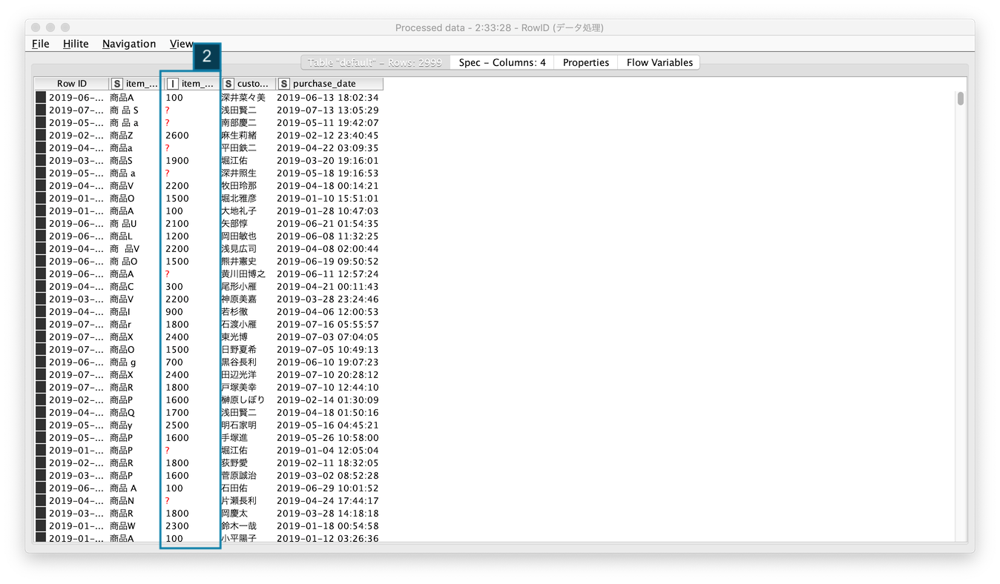
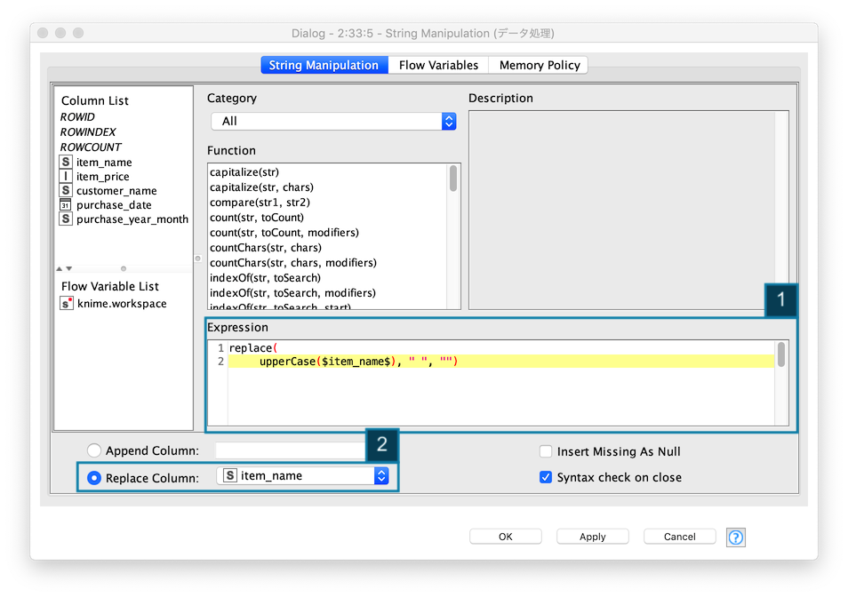
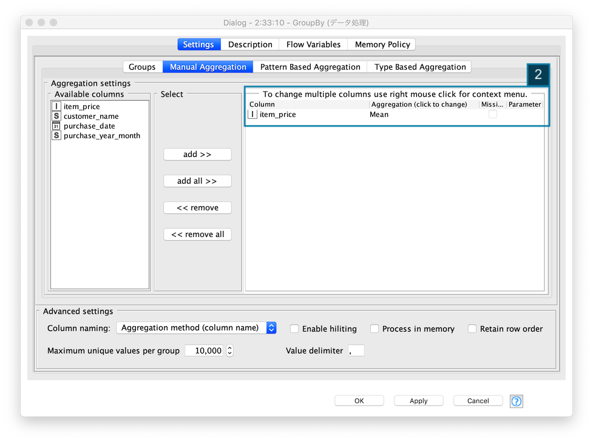
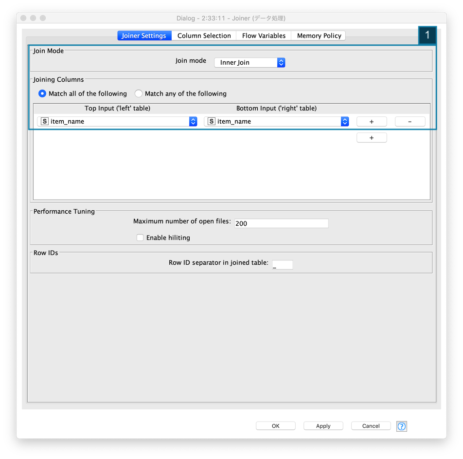
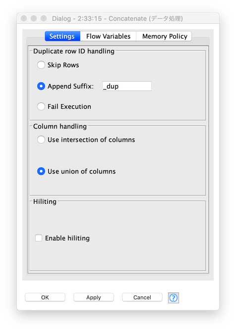
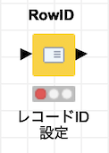

# データ分析プラットフォーム / KNIME

## ToC

* [KNIME 概要](#knime-概要)
* [KNIME 入門編 / 前処理 (1)](#knime-入門編--前処理-1)
    * [顧客マスタ 前処理](#顧客マスタ-前処理)
	* [売上データ 前処理](#売上データ-前処理)
    * [使用ノード一覧](#使用ノード一覧)

## KNIME 概要

* [KNIME (ナイム)](https://www.knime.com/)は、データ連携・統合・分析を自動化することができるエンドツーエンドのデータ分析プラットフォームです
	* ワークフロー型データ分析プラットフォーム - ノードと呼ばれる機能のかたまり(モジュール)を繋げていくことで、さまざまな処理を実現します
	    * データ分析、操作、視覚化、およびレポート
	* 2000を超えるノード、数多くのワークフローサンプル、包括的な統合ツール、様々なアルゴリズムが利用でき、データに隠されている可能性を発見したり、新たな知見を得たり、未来を予測するのに役立ちます
	    * 多様な拡張機能の提供
			* Text Mining
			* Network Mining
			* Cheminformatics
			* Many integrations - Java, R, Python, Weka, H2O, etc
	* ビルトイン機械学習モジュールを利用し、高度な分析や分析の自動化を実現することができます

#### KNIME IDE


1. Workflow エディター
2. Node リポジトリー
3. コンソール


KNIMEのノードは データに対してタスクを実行します。各ノードには設定画面があるので「入力、処理、出力」の設定を行なったタ後、処理を実行 *(画面上部の実行ボタンをクリックする)* します。ノードとノードを接続しワークフローを作成します。


現在のノードのステータスは、ワークフローエディター内のノードアイコン下部に表示されるノードステータスでわかります。ノードステータスには、次の４種類あります。

1. Not Configured *(未設定)*
2. Configured *(設定済み)*
3. Executed *(実行済み)*
4. Error *(実行エラー)*


## KNIME 入門編 / 前処理 (1)

ビッグデータでは、大量のテキストデータ、数値データを扱います。数値データには、欠損値、異常値などを含む為、そのままデータ分析を進めても期待した結果・効果を得ることができません。データ分析では、データの誤り、漏れ、不足、矛盾を事前にチェックし、データを整える「前処理」という工程が必要とされています。今回は、顧客マスタと売上データの二つのデータの前処理を行います。その結果をCSV形式ファイルに保存し、次回の探索的データ分析 *(可視化含む)* に進みます。


### 概要

1. 顧客マスタ データ処理
2. 売上データ データ処理
3. 顧客マスタ, 売上データ結合
4. CSV形式ファイル出力

*Fig. 実装後ワークフロー*


#### 顧客マスタ 前処理

*Fig. 顧客マスタ.前処理ワークフロー*


処理概要:

- データ読込み:
	- `顧客マスター` Excelファイル 読込み
- 前処理:
	- `氏名` スペース除去
	- `登録日`
		- データ型統一
		- _Excel シリアル値_ を日付型に変換
		- レコードマージ
- データ出力:
	- データ処理後 `顧客マスター` CSV形式ファイル出力 *(再利用)*


#### 1. 顧客マスター Excelファイル 読込み

KNIMEに 顧客マスターファイル *(Excel)* を読み込み、レコードを確認します。


1. ローカルファイル上にある `顧客マスター Excelファイル` を指定する
2. Excelファイルの読み込み成功後、データプレビューエリアにレコードが表示される

- 利用ノード: [IO / Read / Excel Reader](https://nodepit.com/node/org.knime.ext.poi2.node.read4.XLSReaderNodeFactory)


#### 2-1. 顧客マスター 前処理 / 氏名カラム / スペース除去

顧客マスター.登録日カラムのフォーマットを統一する為、不要なスペース *(Whitespace)* を除去します。


1. `replace関数` を使い `" "` スペースを除去する
2. 既存の列, 顧客名を指定し、処理結果を上書きする

- 利用ノード: [Manipulation / Column / Convert & Replace / String Manipulation](https://nodepit.com/node/org.knime.base.node.preproc.stringmanipulation.StringManipulationNodeFactory)


#### 2-2. 顧客マスター 前処理 / 登録日カラム / 日付フォーマット判定 + レコード分割

`登録日` カラムの値が 期待する日付フォーマットと それ以外に分類します。


1. 検査対象カラムに　`登録日` を指定する
2. 期待する日付フォーマットを 正規表現 - `^(\d{4})/(\d{2})/(\d{2})$` を指定する

- 利用ノード: [Manipulation / Row / Filter / Row Splitter](https://nodepit.com/node/org.knime.base.node.preproc.filter.row.RowFilter2PortNodeFactory)

##### 除外レコード (Filtered Out)

ノードアイコン を選択し、処理メニューの中の **Filtered Out** を実行することで、除外レコード *(期待する日付フォーマット以外)* のレコードが表示されます。

*Fig. 処理メニュー*


*Fig. 除外レコード表*

`登録日` カラムの値が `reserved-*x1F` となっていて 日付フォーマットでないことが確認できます。


#### 2-3. 顧客マスター 前処理 / 登録日カラム / 文字列置換

「2-1. 顧客マスター 前処理 / 氏名カラム / スペース除去」と同様に `String Manipulation` ノードを使って、文字列置換を行う - 値から 文字列 `reserved-` と `x1F` を除去します。

```java
replace(replace($登録日$, "reserved-", ""), "x1F", "")
```

- 利用ノード: [Manipulation / Column / Convert & Replace / String Manipulation](https://nodepit.com/node/org.knime.base.node.preproc.stringmanipulation.StringManipulationNodeFactory)


#### 2-4. 顧客マスター 前処理 / 登録日カラム / 文字列から数値へ変換

前のノード - 「2-3. 顧客マスター 前処理 / 登録日カラム / 文字列置換」で `登録日` から不要な文字列を除去し、シリアル値 *(文字列)* に整形したので、それを数値に変換すます。


- 利用ノード: [Manipulation / Column / Convert & Replace / String To Number](https://nodepit.com/node/org.knime.base.node.preproc.colconvert.stringtonumber2.StringToNumber2NodeFactory)


#### 2-5. 顧客マスター 前処理 / 登録日カラム / Javaコード - シリアル値からUnix Timestampへ変換

前のノード - 「2-4. 顧客マスター 前処理 / 登録日カラム / 文字列から数値へ変換」で `登録日` のシリアル値を得ることができたので、さらにその値を Unix Timestampに変換します。


- 利用ノード: [Scripting / Java / Java Snipet](https://nodepit.com/node/org.knime.base.node.jsnippet.JavaSnippetNodeFactory)


#### 2-6. 顧客マスター 前処理 / 登録日カラム / Unix Timestampから日付型へ変換

前のノード - 「2-5. 顧客マスター 前処理 / 登録日カラム / Javaコード - シリアル値からUnix Timestampへ変換」で `登録日` の Unix Timestampの値を得ることができたので、日付型に変換します。


- 利用ノード: [Other / Data Types / Time Series / Transform / UNIX Timestamp to Date&Time](https://nodepit.com/node/org.knime.time.node.convert.timestamptodatetime.TimestampToDateTimeNodeFactory)


#### 2-7. 顧客マスター 前処理 / レコード結合

`登録日` カラムの不正な値を日付型に修正したレコードと、最初から日付型のレコードを結合し、データ分析用のレコードセットを作成する。処理後のレコードは、`Concatenated table` を実行することで確認することができます。


- 利用ノード: [Manipulation / Row / Transform / Concatenate](https://nodepit.com/node/org.knime.base.node.preproc.append.row.AppendedRowsNodeFactory)

#### 3. データ処理後 ファイル出力

前処理を完了したレコードをCSV形式で保存しておくことで、再利用することができる。ファイルの保存先を指定し、既に同名称のファイルが存在する時は、上書きするように `If file exists...: Overwrite` を指定します。


- 利用ノード: [IO / Write / CSV Writer](https://nodepit.com/node/org.knime.base.node.io.csvwriter.CSVWriterNodeFactory)


### 売上データ 前処理

*Fig. 売上データ.前処理wワークフロー*


処理概要:

- データ読込み:
	- `売上データ` CSV形式ファイル 読込み
- 前処理:
	- `購買日`
		- RowIDを元に、`購買日` 列追加
		- データ型統一 文字列から日付型へ
		- `購買日` を元に、`購買年月` 列追加
	- `商品名`  スペース除去 *(文字列処理)*
	- `商品価格`
		- 欠損値処理
			- 欠損値存在レコード, 未存在レコード 分割
			- 欠損値置換値 算出と置換
			- レコード結合, 欠損値処理済レコードと欠損値処理対象外レコード


#### 1. 売上データ CSVファイル 読込み

KNIMEに 売上データファイル *(CSV)* を読み込み、レコードを確認します。

1. ローカルファイル上にある `売上データ CSVファイル` を指定する
2. CSVファイルの読み込み成功後、データプレビューエリアにレコードが表示される

- 利用ノード: [IO / Read / CSV Reader](https://nodepit.com/node/org.knime.base.node.io.csvreader.CSVReaderNodeFactory)
- 参考: [顧客マスタ 前処理 / 1. 顧客マスター Excelファイル 読込み](#1-顧客マスター-excelファイル-読込み)


#### 2-1. 売上データ 前処理 / 購買日 / カラム追加

KNIMEでは、先頭カラムを`RowID`にする為、RowIDを元に `購買日` カラムを追加します。処理結果に `購買日`カラムが追加されていることを確認します。

*Fig. RowIDを元にカラム追加*


*Fig. カラム追加後レコード*



- 利用ノード: [Manipulation / Row / Other / RowID](https://nodepit.com/node/org.knime.base.node.preproc.rowkey2.RowKeyNodeFactory2)


#### 2-2. 売上データ 前処理 / 購買日 / データ型変更

`購買日`カラムのデータ型を文字列から日付に変更します

*Fig. 文字列から日付に変換*


- 利用ノード: [Other Data Types / Time Series /Transform / String to Date&Time](https://nodepit.com/node/org.knime.time.node.convert.stringtodatetime.StringToDateTimeNodeFactory)


#### 2-3. 売上データ 前処理 / 購買年月 / カラム作成

`購買日`カラムを元に `購買年月`カラムを作成し、集計時の集計項目として利用します

*Fig. 購買日カラムから購買年月カラムを作成*


- 利用ノード: [Other Data Types / Time Series /Transform / Date&Time to String](https://nodepit.com/node/org.knime.time.node.convert.datetimetostring.DateTimeToStringNodeFactory)


#### 2-4. 売上データ 前処理 / 購買年月 / カラム名変更

`購買年月`カラムを正しい名称に変更します

* `purchase_data(String)`を選択する
* カラム名: `purchase_year_month`, データ型: `StringValue` を指定する

*Fig. 購買年月カラム名 変更*


- 利用ノード: [Other Data Types / Time Series /Transform / Date&Time to String](https://nodepit.com/node/org.knime.time.node.convert.datetimetostring.DateTimeToStringNodeFactory)


#### 2-5. 売上データ 前処理 / 商品名 / スペース除去等 (文字列処理)

各レコードの `商品名`の値が統一されていない為、`商品名` カラムの値を整形します

* スペース除去
* 文字を大文字に統一

*Fig. 商品名 文字列処理*



```java
replace(
	upperCase($item_name$), " ", "")
```

- 利用ノード: [Manipulation / Column / Convert & Replace / String Manipulation](https://nodepit.com/node/org.knime.base.node.preproc.stringmanipulation.StringManipulationNodeFactory)


#### 2-6. 売上データ 前処理 / 商品価格 / 欠損値レコード抽出

商品価格カラムの `欠損値` のレコードを抽出し、除外されたレコード *(正しいレコード)* を元に欠損値を置換する値を 「2-7」からの処理で算出します。抽出した `欠損値` を保有するレコードを確認します。

*Fig. レコード分割 - 欠損値レコード抽出*


*Fig. レコード分割 - 欠損値レコード*


- 利用ノード: [Manipulation / Row / Filter / Row Splitter](https://nodepit.com/node/org.knime.base.node.preproc.filter.row.RowFilter2PortNodeFactory)


#### 2-7. 売上データ 前処理 / 商品別 商品価格 平均算出

`item_name (商品名)` 別 `item_price (商品価格)` の平均値を算出します。

*Fig. 商品別 商品価格 平均算出*





- 利用ノード: [Manipulation / Row / Transform / GroupBy](https://nodepit.com/node/org.knime.base.node.preproc.groupby.GroupByNodeFactory)


#### 2-8. 売上データ 前処理 / 商品別 商品価格 置換-1 (テーブル連結)

「2-2. 欠損値抽出されたレコード」 と 「2-7. 欠損値を補完するレコード」を結合します。`Mean(item_price)` カラムが欠損値を補完する値になります。

*Fig. テーブル結合 - 商品価格に欠損値が存在したレコード + *



*Fig. テーブル結合後レコード*


- 利用ノード: [Manipulation / Column / Split & Combine / Joiner](https://nodepit.com/node/org.knime.base.node.preproc.joiner.Joiner2NodeFactory)


#### 2-9. 売上データ 前処理 / 商品別 商品価格 置換-2 (不要カラム削除)

`item_price (商品価格)` カラムを削除対象に指定し、`Mean(item_price) (平均商品価格)` カラムを残します。

*Fig. カラムフィルター / 不要カラム削除*


- 利用ノード: [Manipulation / Column / Filter / Column Filter](https://nodepit.com/node/org.knime.base.node.preproc.filter.column.DataColumnSpecFilterNodeFactory)


#### 2-10. 売上データ 前処理 / 商品別 商品価格 置換-2 (カラム名変更)

テーブル結合した後の `Mean(item_price) (平均商品価格)` カラムの名称を `item_price (商品価格)` 変更します。

*Fig. カラム名変更*


- 利用ノード: [Manipulation / Column / Convert & Replace / Column Rename](https://nodepit.com/node/org.knime.base.node.preproc.rename.RenameNodeFactory)


#### 2-11. 売上データ 前処理 / 商品価格 / 欠損値置換

「2-2. 欠損値レコード抽出処理」で 欠損値処理対象外レコードと、「2-10. 欠損値処理を行なったレコード」を一つのテーブルにします。


*Fig. レコード結合*



*Fig. レコード結合 結果*


- 利用ノード: [Manipulation / Row / Transform / Concatenate](https://nodepit.com/node/org.knime.base.node.preproc.append.row.AppendedRowsNodeFactory)


### 使用ノード一覧

|  カテゴリー |モジュール  |  機能  |
| :----: | :----: | :--- |
|  IO |  | Excel スプレッドシートをの1つのシートからデータのみを読み取ります。数値、日付、ブール値、文字列のデータのみを読み取ることができます。図、写真、その他のアイテムは読み取ることができません  |
|  IO |  |  CSVファイルを読み取ります。ノードが実行されると、入力ファイルをスキャンして列の数とタイプを決定し、自動推測された構造を持つテーブルを出力します  |
|  IO |  |  入力データテーブルをファイルまたはURLで示されるリモートの場所にCSVフォーマットで書き込みます  |
| Manipulation / Column / Convert, Replace |  |  検索と置換、大文字と小文字の区別、先頭と末尾の空白などの文字列を操作します  |
| Manipulation / Column / Convert, Replace |  |  列 *(または列のセット)* 内の文字列を数値に変換します  |
| Manipulation / Column / Convert, Replace |  |  列名を変更するか、そのタイプを変更します  |
|  TIme Series / Transform |  | エポック *(1970年1月1日)* 以降の秒単位、ミリ秒単位、マイクロ秒単位、またはナノ秒単位のUNIXタイムスタンプでなければなりません。出力は、ローカルとゾーンの日付と時刻の形式を選択し、必要に応じてタイムゾーンを追加できます  |
|  TIme Series / Transform |  |  DateTimeFormatterで定義されているユーザー指定のフォーマットパターンを使用して、Date＆Time列の時刻値を文字列に変換します  |
|  TIme Series / Transform |  |  文字列を解析し、指定されたフォーマットパターンを使用して日付と時刻のセルに変換します。日付には、月や曜日の名前などのローカライズされた用語が含まれる場合があるのでロケールを選択できます |
| Row / Filter |  |  `Row Filter` とまったく同じ機能を備えています。パフォーマンスとディスク容量の理由から、行フィルターノードの使用を検討する必要があります  |
| Row / Other |  |  入力データの `RowID` を別の列の値 *(値を文字列に変換すること)* にすることができます *(列を新規に作成することも可能)*  |
| Row / Transform |  |  2つのテーブルを連結します  |
| Row / Transform |  |  選択したグループ列の一意の値でテーブルの行をグループ化します。選択したグループ列の値の一意のセットごとに行が作成されます。残りの列は、指定した集計設定に基づいて集計されます  |
| Column / Filter |  | 入力テーブルの不要な列を出力テーブルから除外します |
| Column / Split and Combine |  |  データベースのような方法で2つのテーブルを結合します (`inner join`, `left outer join` , `right outer join`, `full outer join` のいずれかを指定する)  |
| Scripting / Java  |  |  任意のJavaコードを実行して、新しい列を作成したり、既存の列を置き換えたりできます  |