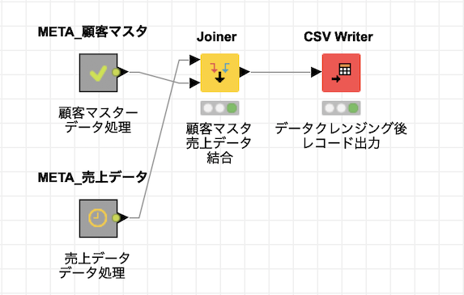
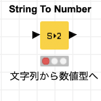
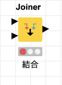

# データ分析プラットフォーム / KNIME
## KNIME 概要

* [KNIME (ナイム)](https://www.knime.com/)は、データ連携・統合・分析を自動化することができるエンドツーエンドのデータ分析プラットフォームです
	* ワークフロー型データ分析プラットフォーム - ノードと呼ばれる機能のかたまり(モジュール)を繋げていくことで、さまざまな処理を実現します
	* 2000を超えるノード、数多くのワークフローサンプル、包括的な統合ツール、様々なアルゴリズムが利用でき、データに隠されている可能性を発見したり、新たな知見を得たり、未来を予測するのに役立ちます
	* ビルトイン機械学習モジュールを利用し、高度な分析や分析の自動化を実現することができます

## KNIME 入門編 / 前処理 (1)

ビッグデータでは、大量のテキストデータ、数値データを扱います。数値データには、欠損値、異常値などを含む為、そのままデータ分析を進めても期待した結果・効果を得ることができません。データ分析では、データの誤り、漏れ、不足、矛盾を事前にチェックし、データを整える「前処理」という工程が必要とされています

### 事例概要

1. 顧客マスタ データ処理
2. 売上データ データ処理
3. 顧客マスタ, 売上データ結合
4. CSV形式ファイル出力

*Fig 1 実装後スクリーンショット*

#### 顧客マスタ 前処理

*Fig 2 顧客マスタ.前処理フロー スクリーンショット*

処理概要:

- データ読込み:
	- `顧客マスター` Excel形式ファイル 読込み
- 前処理:
	- `氏名` スペース除去
	- `登録日`
		- データ型統一
		- _Excel シリアル値_ を日付型に変換
		- レコードマージ
- データ出力:
	- データ処理後 `顧客マスター` CSV形式ファイル出力 *(再利用)*

#### 売上データ 前処理

*Fig 3 売上データ.前処理フロー スクリーンショット*

処理概要:

- データ読込み:
	- `売上データ` CSV形式ファイル 読込み
- 前処理:
	- `購買日`
		- RowIDを元に、`購買日` 列追加
		- データ型統一 文字列から日付型へ
		- `購買日` を元に、`購買年月` 列追加
	- `商品名`  スペース除去 *(文字列処理)*
	- `商品価格`
		- 欠損値処理
			- 欠損値存在レコード, 未存在レコード 分割
			- 欠損値置換値 算出と置換
			- レコード結合, 欠損値処理済レコードと欠損値処理対象外レコード

### 今回利用したノード (モジュール)

|  カテゴリー |モジュール  |  機能  |
| :----: | :----: | :--- |
|  IO |  | Excel スプレッドシートをの1つのシートからデータのみを読み取ります。数値、日付、ブール値、文字列のデータのみを読み取ることができます。図、写真、その他のアイテムは読み取ることができません  |
|  IO |  |  CSVファイルを読み取ります。ノードが実行されると、入力ファイルをスキャンして列の数とタイプを決定し、自動推測された構造を持つテーブルを出力します  |
|  IO |  |  入力データテーブルをファイルまたはURLで示されるリモートの場所にCSVフォーマットで書き込みます  |
| Manipulation / Column / Convert, Replace |  |  検索と置換、大文字と小文字の区別、先頭と末尾の空白などの文字列を操作します  |
| Manipulation / Column / Convert, Replace |  |  列 *(または列のセット)* 内の文字列を数値に変換します  |
| Manipulation / Column / Convert, Replace |  |  列名を変更するか、そのタイプを変更します  |
|  TIme Series / Transform |  | エポック *(1970年1月1日)* 以降の秒単位、ミリ秒単位、マイクロ秒単位、またはナノ秒単位のUNIXタイムスタンプでなければなりません。出力は、ローカルとゾーンの日付と時刻の形式を選択し、必要に応じてタイムゾーンを追加できます  |
|  TIme Series / Transform |  |  DateTimeFormatterで定義されているユーザー指定のフォーマットパターンを使用して、Date＆Time列の時刻値を文字列に変換します  |
|  TIme Series / Transform |  |  文字列を解析し、指定されたフォーマットパターンを使用して日付と時刻のセルに変換します。日付には、月や曜日の名前などのローカライズされた用語が含まれる場合があるのでロケールを選択できます |
| Row / Filter |  |  `Row Filter` とまったく同じ機能を備えています。パフォーマンスとディスク容量の理由から、行フィルターノードの使用を検討する必要があります  |
| Row / Other |  |  入力データの `RowID` を別の列の値 *(値を文字列に変換すること)* にすることができます *(列を新規に作成することも可能)*  |
| Row / Transform |  |  2つのテーブルを連結します  |
| Row / Transform |  |  選択したグループ列の一意の値でテーブルの行をグループ化します。選択したグループ列の値の一意のセットごとに行が作成されます。残りの列は、指定した集計設定に基づいて集計されます  |
| Column / Filter |  | 入力テーブルの不要な列を出力テーブルから除外します |
| Column / Split and Combine |  |  データベースのような方法で2つのテーブルを結合します (`inner join`, `left outer join` , `right outer join`, `full outer join` のいずれかを指定する)  |
| Scripting / Java  |  |  任意のJavaコードを実行して、新しい列を作成したり、既存の列を置き換えたりできます  |
