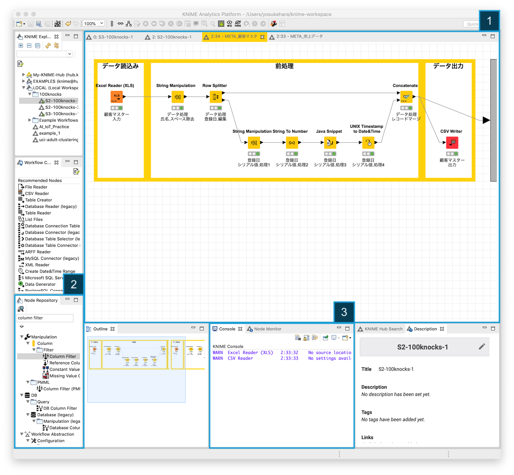
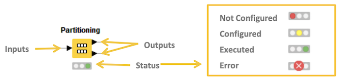

# KNIME 概要

* 初版作成日: 2020-03-31
* 最終更新日: 2020-04-11

* [KNIME (ナイム)](https://www.knime.com/)は、データ連携・統合・分析を自動化することができるエンドツーエンドのデータ分析プラットフォームです
	* ワークフロー型データ分析プラットフォーム - ノードと呼ばれる機能のかたまり(モジュール)を繋げていくことで、さまざまな処理を実現します
		* データ分析、操作、視覚化、およびレポート
	* 2000を超えるノード、数多くのワークフローサンプル、包括的な統合ツール、様々なアルゴリズムが利用でき、データに隠されている可能性を発見したり、新たな知見を得たり、未来を予測するのに役立ちます
		* 多様な拡張機能の提供
			* Text Mining
			* Network Mining
			* Cheminformatics
			* Many integrations - Java, R, Python, Weka, H2O, etc
	* ビルトイン機械学習モジュールを利用し、高度な分析や分析の自動化を実現することができます

## KNIME IDE

1. Workflow エディター
2. Node リポジトリー
3. コンソール

KNIMEのノードは データに対してタスクを実行します。各ノードには設定画面があるので「入力、処理、出力」の設定を行なったタ後、処理を実行 *(画面上部の実行ボタンをクリックする)* します。ノードとノードを接続しワークフローを作成します。

現在のノードのステータスは、ワークフローエディター内のノードアイコン下部に表示されるノードステータスでわかります。ノードステータスには、次の４種類あります。

1. Not Configured *(未設定)*
2. Configured *(設定済み)*
3. Executed *(実行済み)*
4. Error *(実行エラー)*

