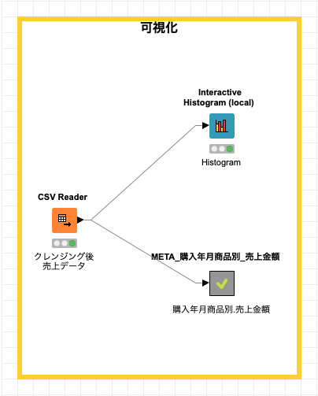

# KNIME 入門編 / 探索的データ分析 (1)

* 作成日: 2020-04-07
* 更新日: 2020-04-12

[前回 - KNIME 入門編 / 前処理 (1)](knime-1.md) で、 (1)オリジナルデータに存在していた欠損値を修正、(2)各カラムのフォーマットを統一 、することを行いました。それにより、データ分析可能なデータを作り、CSV形式ファイルに保存しました。

今回は、探索的データ分析 *(<a href="https://en.wikipedia.org/wiki/Exploratory_data_analysis" target="_blank">Exploratory Data Analysis: EDA</a>)* - データの集計、要約、可視化を行い、データの特徴を把握します。
データを分析する前に どのようなデータなのか確認する段階が必要です。データに対する理解を深めることで、良いモデルの構築に繋がる可能性を高めるからです。

データを俯瞰し、欠損値、異常値(外れ値)、データの分布などデータ全体あるいはデータ間の関係性やそのばらつきを見る為に、この段階では、簡単な集計とデータを各種チャート作成します。

## ワークフロー全体

1. クレンジング後売上データ *(CSV形式ファイル)* 読み込み
2. ヒストグラム作成
3. 購入年月別 商品別 売上金額 可視化

ワークフローは下の図に示した通りです。[前回 - KNIME 入門編 / 前処理 (1)](knime-1.md)でオリジナルデータをデータ分析が行えるデータに修正し、それを CSV形式ファイルとして保存し、そのデータを使い可視化を行います。

*Fig. 全体ワークフロー*

## データ クレンジング後 売上データ 読み込み

[前回作成した 「データ クレンジング後 売上データ」](knime-1.md#csv) を指定し、KNIMEに読み込みます。その後、読み込んだデータが正しく認識されているか `File Table` を実行し確認します。

*Fig. CSV Reader 設定*

*Fig. レコード一覧 (File Table)*

* 利用ノード: [IO / Read / CSV Reader](https://nodepit.com/node/org.knime.base.node.io.csvreader.CSVReaderNodeFactory)

## ヒストグラム チャート 作成

ヒストグラムを作成しデータの特徴を把握します。`purchase_year_month (購入年月)` をビニングカラムに指定し、`item_price　(商品価格)` を集計対象カラムに指定します。

*Fig. ヒストグラムノード 設定*

`View: Interactive Histogram View` を実行し、処理後のヒストグラムチャートを表示します。

*Fig. ヒストグラムノード コンテキストメニュー*

下の図では、購入年月別の `item_price (商品価格)` カラムのレコードの合計を集計したチャートを表示しています。**1. 集計方法の変更** と **2. ビニングカラムの変更** が可能です。

* 集計方法:
	* Average *(平均)*
	* Sum *(合計)*
	* Row Count *(行数)*
	* Row Count w/o missin values *(欠損値を除く行数)*
* ビニングカラム:
	* item_name *(商品名)*
	* purchase_year_and_month *(購入年月)*
	* item_price *(商品価格)*
	* 地域

*Fig. ヒストグラム*

Interactive Histogram *(対話型ヒストグラム)* ノード を利用することで、容易にデータの特徴を把握できることがわかりました。

* 利用ノード: [Views / Local (Swing) / Interactive Histogram (Local)](https://nodepit.com/node/org.knime.base.node.viz.histogram.node.HistogramNodeFactory)

## 可視化
### 購入年月別 商品別 売上金額

処理概要:

- データ処理:
	- ピボットテーブル作成
	- 欠損値処理
- 可視化:
	- Data Explorer - データ探索
	- Box Plot - ボックス プロット *(箱ひげ図)*
	- Line Plot - ライン プロット *(折れ線)*
	- Stacked Area Chart - 積重ねエリア チャート
	- Bar Plot - バー チャート

*Fig. 可視化/購入年月別 商品別 売上金額 ワークフロー*

#### データ処理/ ピボットテーブル作成

**購入年月別 商品別 売上金額テーブル** を作成します。

* Group column(s) に `purchase_year_and_month (購入年月)` カラムを指定する
* Pivoit column(s) に `item_name (商品名)` カラムを指定する
* 集計対象に `item_price (商品価格)` カラムを指定し、集計方法を `Sum (合計)` とする

*Fig. ピボットテーブル ノード 設定 (1)*

*Fig. ピボットテーブル ノード 設定 (2)*

*Fig. ピボットテーブル ノード 設定 (3)*

コンテキストメニュー *(ポップアップメニュー)* 内の **Pivot Table** を実行し、購入年月別 商品別 売上金額テーブルを表示します。処理結果と、`商品Z` に欠損値があることを確認します。

*Fig. ピボットテーブル ノード コンテキストメニュー*

*Fig. ピボットテーブル*

#### データ処理/ 欠損値処理

購入年月別 商品別 売上金額テーブルの`商品Z` の欠損値に 0 を設定し、可視化処理用のデータを作成します。処理後のテーブルの確認方法は、前のステップと同様に コンテキストメニュー *(ポップアップメニュー)* 内の **Output Table** を実行します。ここで作成したテーブルを元にして各可視化ノードを実行します。

* 設定画面 Number (double): `Fix Value, Value: 0.0` を指定する

*Fig. 欠損値処理ノード 設定*

#### 可視化 / データ探索

商品別の統計情報を確認します。統計情報に次の情報が含まれています - `Minimum (最小値)`, `Maximum (最大値)`, `Mean (平均)`, `Median (中央値)`, `Standard Deviation (標準偏差)`, `Variance (分散)`, `Skewness (歪度)`, `Kurtosis (尖度)`, `Overall Sum (総和)` 尚、`Median (中央値)` はデフォルトで計算対象外になっている為、必要な時は有効にする必要があります。統計情報の列をクリックすることで、降順/昇順ソートすることが出来ます。

*Fig. データ探索ノード 処理結果 (1)*

各行に表示されている [+]ボタン をクリックすることで、選択行の下部にヒストグラムを出力します。

*Fig. データ探索ノード 処理結果 (2)*

#### 可視化 / ボックス プロット

全商品を対象とする **ボックス プロット (箱ひげ図)** を作成し、データの分布を確認します。データ探索ノードよりも直感的にデータを把握することができます。

*Fig. ボックスプロット ノード 設定*

*Fig. ボックスプロット*

* 参考: <a href="https://ja.wikipedia.org/wiki/%E7%AE%B1%E3%81%B2%E3%81%92%E5%9B%B3" target="_blank">箱ひげ図</a>

#### 可視化 / ライン プロット

X軸に購入年月別を, Y軸に商品価格の総和を指定し、全商品を対象にしたラインプロットを作成します。

*Fig. ラインプロット ノード 設定 (1)*

*Fig. ラインプロット ノード 設定 (2)*

*Fig. ラインプロット*

商品数が多い為、直感的にデータの特徴を把握することができないことがわかります。積重ねエリアチャートとバーチャートを作成し、ラインプロットとの違いを検証します。

#### 可視化 / 積重ねエリアチャート

X軸に購入年月別を, Y軸に商品価格の総和を指定し、全商品を対象にした積重ねエリアチャートを作成します。ラインプロットと比較して、購入年月別の売上総額、商品別がどれくらい売上全体に対してに占めているか把握することができます。

*Fig. 積重ねエリアチャート ノード 設定*

*Fig. 積重ねエリアチャート*

#### 可視化 / バーチャート

X軸に購入年月別を, Y軸に商品価格の総和を指定し、全商品を対象にした積重ねバーチャートを作成します。積重ねエリアチャートと同様に、ラインプロットと比較して、購入年月別の売上総額、商品別がどれくらい売上全体に対してに占めているか把握することができます。

*Fig. バーチャート ノード 設定*

*Fig. バーチャート*

#### 利用ノード

* [Manipulation / Row / Transform / Pivoting](https://nodepit.com/node/org.knime.base.node.preproc.pivot.Pivot2NodeFactory)
* [Manipulation / Column / Transform / Missing Value](https://nodepit.com/node/org.knime.base.node.preproc.pmml.missingval.compute.MissingValueHandlerNodeFactory)
* [Nodes / KNIME Labs / JavaScript Views (Labs) / Data Explorer](https://nodepit.com/node/org.knime.base.node.stats.dataexplorer.DataExplorerNodeFactory)
* [Views / JavaScript / Box Plot](https://nodepit.com/node/org.knime.dynamic.js.v30.DynamicJSNodeFactory%23Box%20Plot)
* [Views / JavaScript / Line Plot](https://nodepit.com/node/org.knime.js.base.node.viz.plotter.line.LinePlotNodeFactory)
* [Views / JavaScript / Stacked Area Chart](https://nodepit.com/node/org.knime.dynamic.js.v30.DynamicJSNodeFactory%23Stacked%20Area%20Chart)
* [Views / JavaScript / Bar Chart](https://nodepit.com/node/org.knime.dynamic.js.v30.DynamicJSNodeFactory%23Bar%20Chart)

### 商品別 売上金額

全期間商品別の売上金額を集計した結果の可視化を行います。この可視化により商品別の売上の相違を把握するこができます。

#### データ処理 / 集計

Group column(s)に `item_name (商品名)` を指定します。

*Fig. 商品別 売上金額 集計 設定 (1)*

集計カラムに `item_price (商品価格)`、集計方法に `Sum (総和)` を指定します

*Fig. 商品別 売上金額 集計 設定 (2)*

#### 可視化 / バーチャート

Category Column *(X軸)* に `item_name (商品名)`、Y軸に `Sum(item_price)` を指定し、下図のバーチャートを出力します。

*Fig. バーチャート ノード 設定*

*Fig. バーチャート*

#### 利用ノード

* [Nodes / Manipulation / RowRow / Transform](https://nodepit.com/node/org.knime.base.node.preproc.groupby.GroupByNodeFactory)
* [Views / JavaScript / Bar Chart](https://nodepit.com/node/org.knime.dynamic.js.v30.DynamicJSNodeFactory%23Bar%20Chart)

### 地域別 売上金額

全期間地域別の売上金額を集計した結果の可視化を行います。この可視化により地域別の売上の相違を把握するこができます。

#### データ処理 / 集計

Group column(s)に `地域` を指定します。

*Fig. 地域別 売上金額 集計 設定 (1)*

集計カラムに `item_price (商品価格)`、集計方法に `Sum (総和)` を指定します

*Fig. 地域別 売上金額 集計 設定 (2)*

#### 可視化 / バーチャート

Category Column *(X軸)* に `地域`、Y軸に `Sum(item_price)` を指定し、下図のバーチャートを出力します。

*Fig. バーチャート ノード 設定*

*Fig. バーチャート*

#### 利用ノード

* [Nodes / Manipulation / RowRow / Transform](https://nodepit.com/node/org.knime.base.node.preproc.groupby.GroupByNodeFactory)
* [Views / JavaScript / Bar Chart](https://nodepit.com/node/org.knime.dynamic.js.v30.DynamicJSNodeFactory%23Bar%20Chart)

## まとめ

データクレンジング後のファイルから、ヒストグラム、箱ひげ図を作成することで、**データの分布を把握** する事ができました。また、**購入年月別商品別 売上金額 の集計結果** を各種チャートを作成したことで、購入年月別の売上総和の比較、その他 集計処理後の可視化により、**全期間の地域別売上金額, 全期間の商品別売上金額**、を直感的に把握する事ができました。このセクションで掲載した内容は一部であり、**購入年月別地域別**、**顧客別** などの可視化を検討する必要があります。

今回は、[KNIME](https://www.knime.com/)を使うことで、詳細なデータ分析を進める前の データ探索、可視化を短時間で行うことが可能になることがわかりました。
