# KNIME 入門編 / クラスタリング

* 初版作成日: 2020-04-17
* 最終更新日: 2020-04-24

今回は、すでにデータ整形が終わっている分析用データ *(トレーニングジム会員の利用履歴)* を使い 会員のクラスタリング *(クラスター分析)* を行い、それぞれのクラスターの行動の傾向を確認します。クラスタリングとは、異なる性質・特徴をもつものが混在する集合から似た性質・特徴を持つグループを作ることです。基本的なデータ解析手法としてデータマイニングでも頻繁に利用されている手法です。

クラスタリングの手法がいくつかありますが、今回は、非階層クラスタリングに属する <a href="https://en.wikipedia.org/wiki/K-means_clustering" target="_blank">k-means</a> を使います。 <strong>非階層クラスタリング</strong>は、予め作成するクラスター数を決定し、決めた数の階層を持たないクラスター *(グループ)* にサンプルを分割する方法です。サンプル数が極めて大きいビッグデータ分析に適しています。

## ワークフロー全体

整形後データ読み込んだ後に、クラスタリングを実行し、最後にクラスタリング結果の可視化と集計を行います。

1. 顧客+利用履歴データ *(CSV形式ファイル)* 読み込み
2. データ探索 *(確認)*
3. クラスタリング
4. 可視化 + 集計

*Fig. 全体ワークフロー*

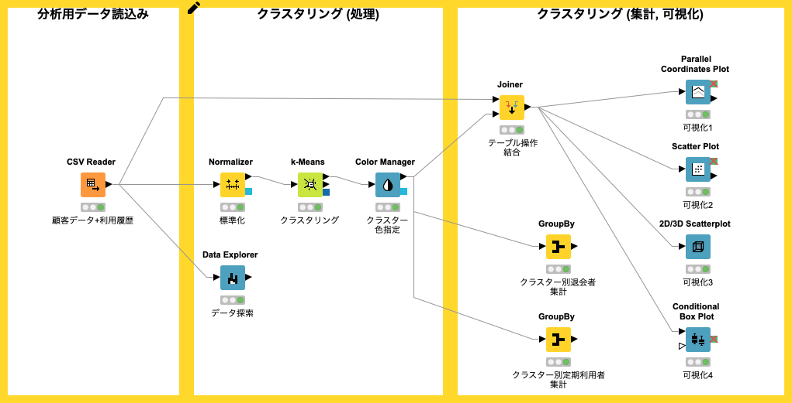

## 分析用データ読み込み
### 顧客データ + 利用履歴 CSVファイル 読込み

読込み対象のCSVファイルの文字コードが `UTF-8` であることを事前に確認した後、KNIMEに 顧客データ + 利用履歴 *(CSV)* を読み込み設定を行います。主に 列タイトル行の存在、区切り文字 *(delimiter)* を設定します。KNIMEにデータのインポートが完了した後に、ファイルが正しくロードされているか確認します。

1. ローカルファイルにある `顧客データ + 利用履歴 CSVファイル` を指定し、`Has Row Header (行見出し存在)` のチェックを外す
2. CSVファイルの読み込み成功後、データプレビューエリアにレコードが表示される

*Fig. CSVファイル 読込み 設定*

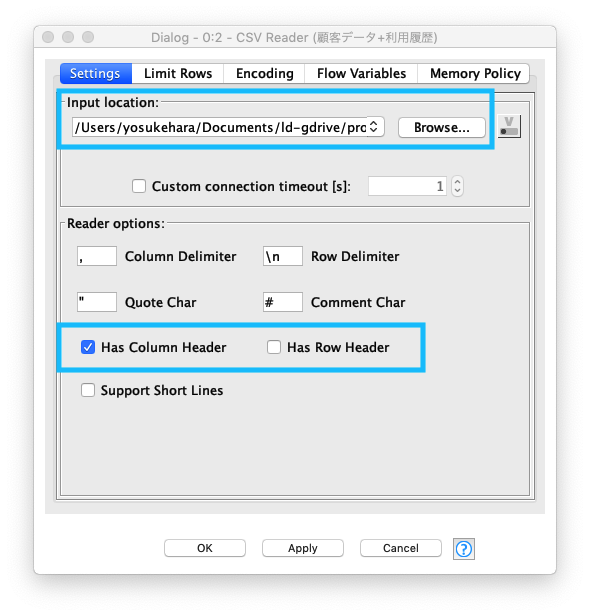

*Fig. CSVファイル テーブル表示*

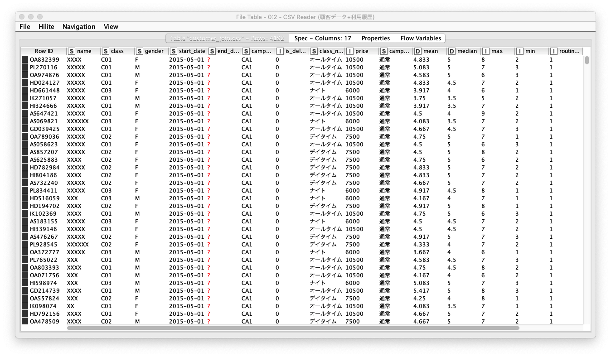

* 利用ノード: [IO / Read / CSV Reader](https://nodepit.com/node/org.knime.base.node.io.csvreader.CSVReaderNodeFactory)

## クラスタリング / 処理

*Fig. クラスタリング / 処理 / ワークフロー*

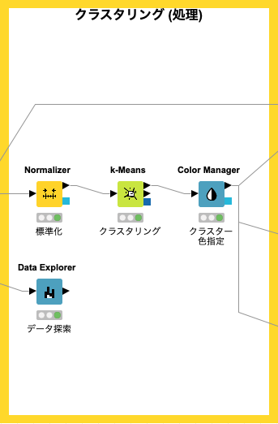

### 準備 / データ探索

読み込んだデータが どのような特徴を持っているのか把握しておく必要があります。`Data Explorer` ノードを使い簡単なデータ分析　- 探索的データ分析 *(Exploratory Data Analysis: EDA)* を行います。次の情報を確認します。

#### 1. 月の利用回数の分布

利用者の月の利用回数は、3回から5回が多いことがわかります

*Fig. データ探索 / mean (利用回数 平均/月)*

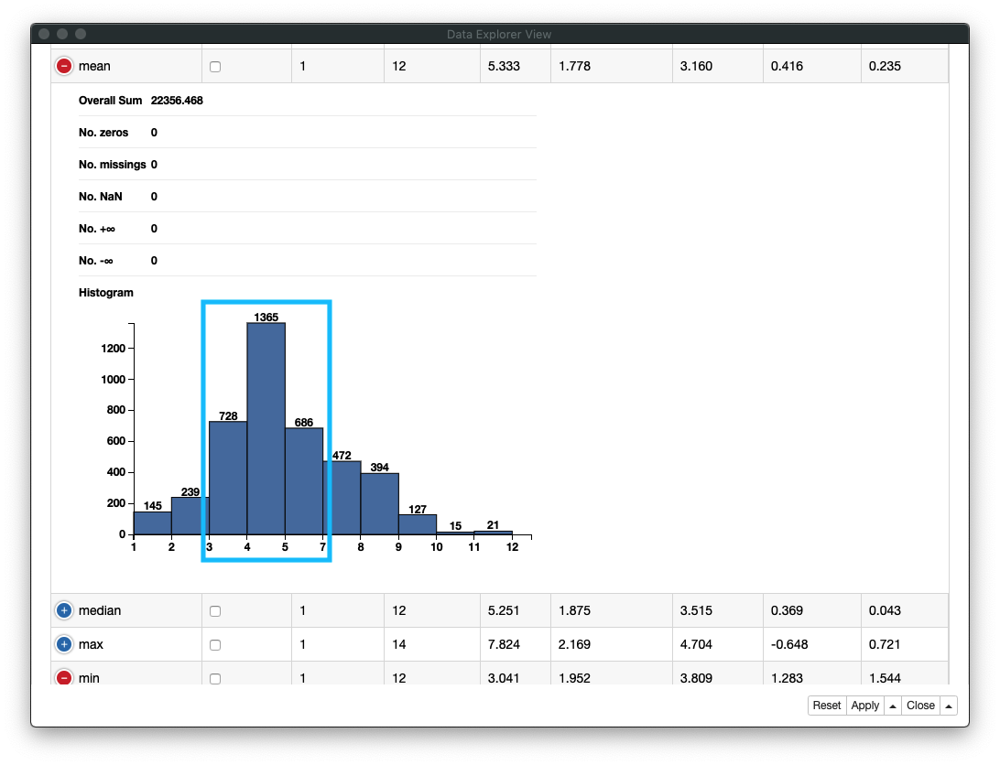

#### 2. 会員期間の分布

会員期間は、1年未満の利用者が多いことがわかります。依って、一年以上の会員期間の利用者は、継続的に利用していることがわかります

*Fig. データ探索 / membership_period (会員期間)*

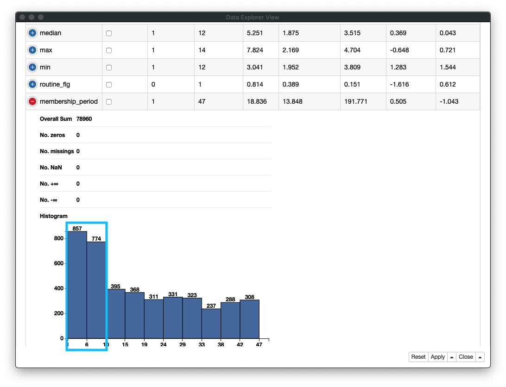

#### 3. 退会会員数

退会会員数は、継続会員数の約半数ということがわかります

*Fig. データ探索 / membership is_deleted (退会)*

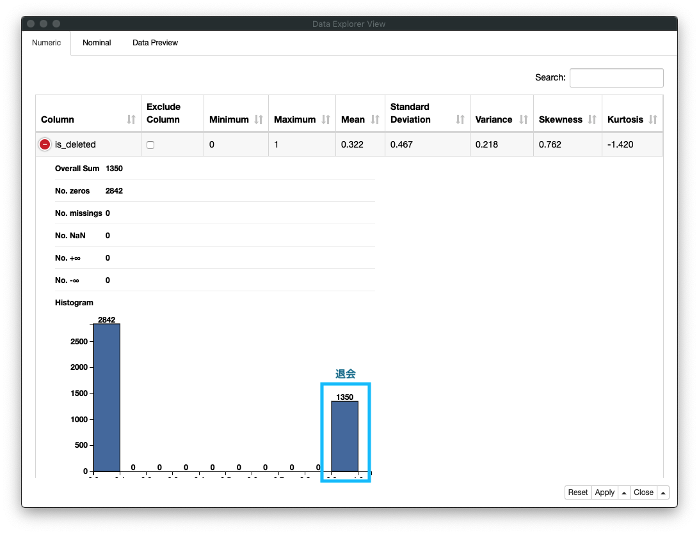

#### 4. 月額金額の分布

月額金額は三種類あり *[6000円, 7500円, 10500円]* 、その中でも10,500円のコースの会員数が他のそれぞれのコースの二倍近くいることがわかります

*Fig. データ探索 / membership price (月額)*

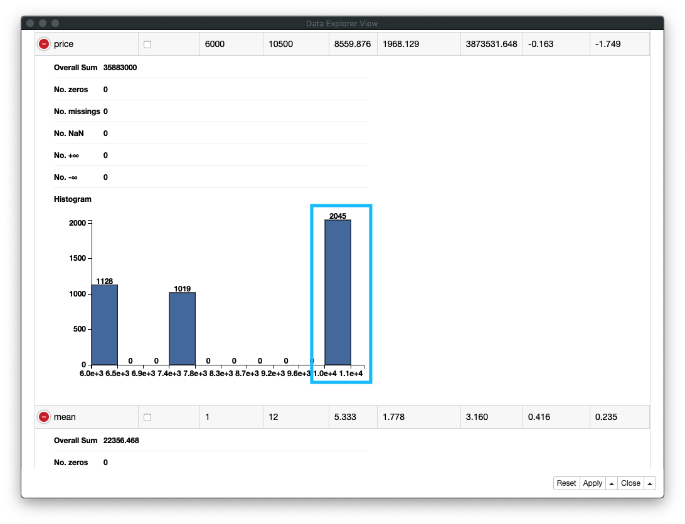

#### 5. 質的データの要約

データの要約 *(サマリー)* を見ていくと、このデータの概要を理解することができます。

`end_date` の結果は、退会した人が 2842人いて ユニークな値が 12存在します。「2842人が退会した日が12日ある」ことを意味します。その一方、`start_date` の結果は、「入会日は 215日ある」その日数は、退会日よりも多いことがわかります。その他、クラ数数、キャンペーンう数等を把握することができます。

*Fig. データ探索 / Nominal*

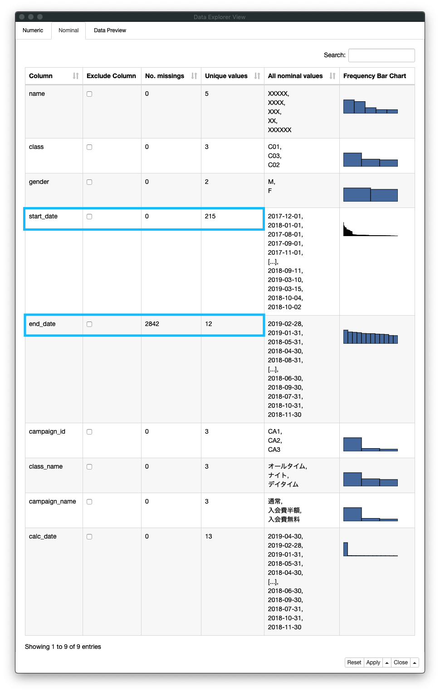

* 利用ノード: [Nodes / KNIME Labs / JavaScript Views (Labs) / Data Explorer](https://nodepit.com/node/org.knime.base.node.stats.dataexplorer.DataExplorerNodeFactory)

### 正規化

クラスタリング処理を行う前に 数値データのスケールを 0から1の範囲に線形変換 *(Linear transformation)* します。

正規化 設定画面で、正規化対象のカラム - `mean (平均 利用回数/月)`, `membership_pedriod (会員期間)` を選択します。

*Fig. Normalizaer 正規化 / 設定*

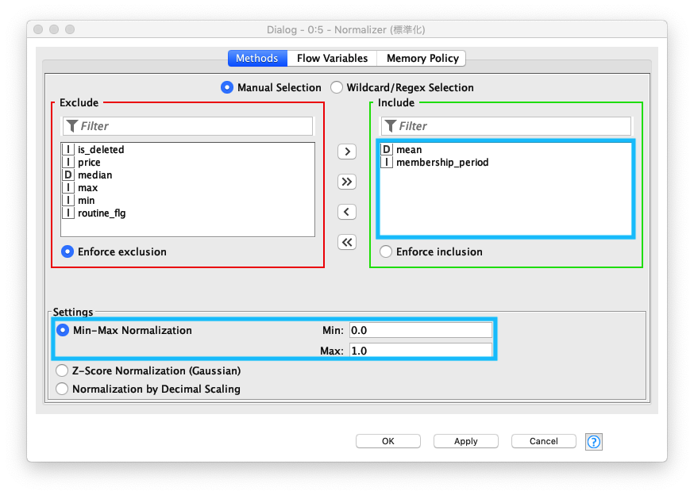

正規化処理後、`mean (平均 利用回数/月)`, `membership_pedriod (会員期間)` の各列の値が 「0〜1 の範囲」に変換されたことを確認します。

*Fig. Normalizaer 正規化 / 正規化 後テーブル*

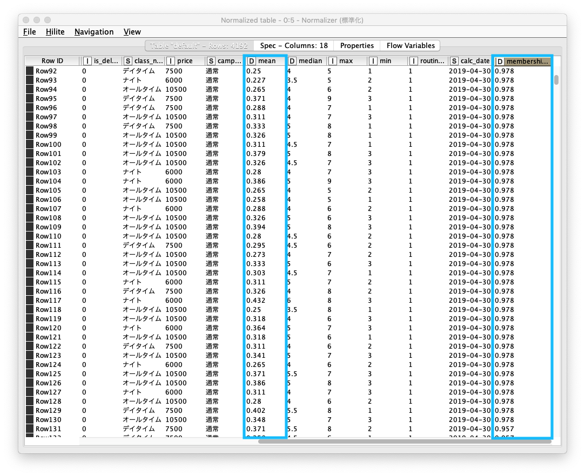

* 利用ノード: [Nodes / Manipulation / Column / Transform / Normalizer](https://nodepit.com/node/org.knime.base.node.preproc.normalize3.Normalizer3NodeFactory)

### クラスタリング

トレーニングジムの会員の行動傾向を4つのクラスターに分けます。クラスタリング 設定画面の `Number of clusters (クラスター数)` の値を 「4」に設定します。また、クラスタリングに必要なカラムに `mean (平均利用回数/月)` と `membership_period (会員期間)` の二つを選択します。

*Fig. クラスタリング 設定*

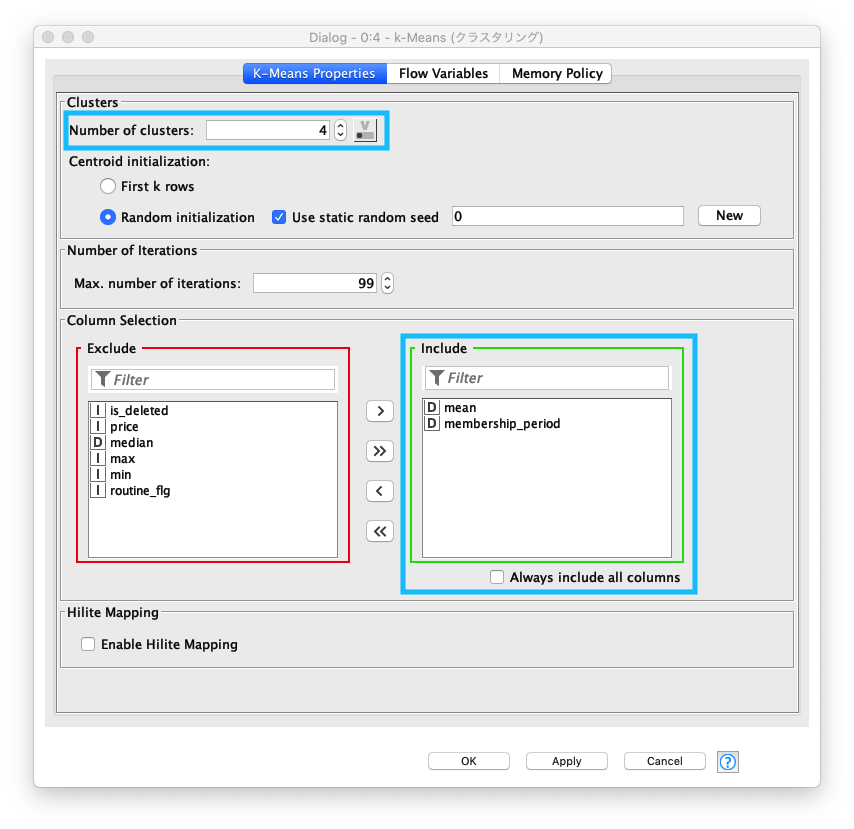

クラスタリング後の結果を コンテキストメニュー *(ポップアップメニュー)* の `Clusters` を実行し、4つのクラスターの存在と、それぞれのクラスターの値を確認します。

*Fig. クラスタリング 結果 テーブル*

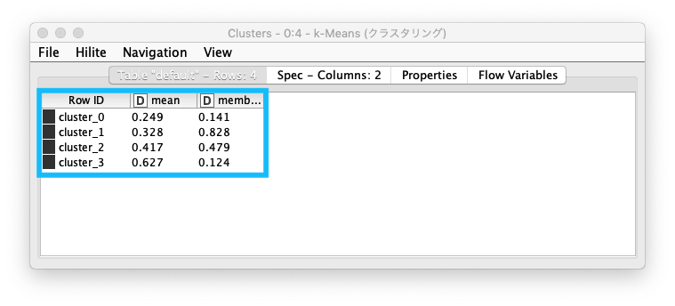

* 利用ノード: [Workflows / KNIME Hub / Users / taka / Public / k-means](https://nodepit.com/workflow/com.knime.hub%2FUsers%2Ftaka%2FPublic%2Fclustering(k-means))

### クラスタリング 色指定

可視化した時に 4つのクラスターに属する値を容易に判別できるように、それぞれのクラスターの色を指定します。この処理に依り、生成されたチャートにプロットされた値がどのクラスターに属しているかわかります。

*Fig. クラスタリング 色指定*

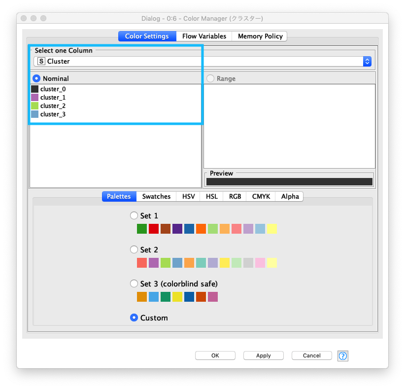

* 利用ノード: [Nodes / Views / Property / Color Manager](https://nodepit.com/node/org.knime.base.node.viz.property.color.ColorManager2NodeFactory)

## クラスタリング / 集計, 可視化

*Fig. クラスタリング / 集計, 可視化*

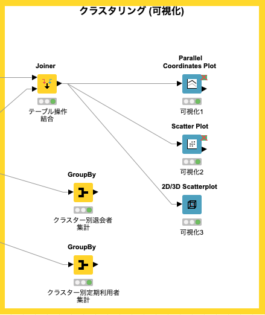

### テーブル結合

正規化処理で 実際のデータと異なる値を持つカラム (`mean (平均利用回数/月)`, `membership_period (会員期間)`) が存在しているので、正規化前後のそれぞれの値を使えるように、正規化前の元のテーブルと正規化後のテーブルを結合します。

* `join mode` に `inner join (内部結合)` を選択する
* 結合するカラムに `left table`、`right table` 共に `Row ID` を指定する

*Fig. テーブル結合 / 設定 (1)*

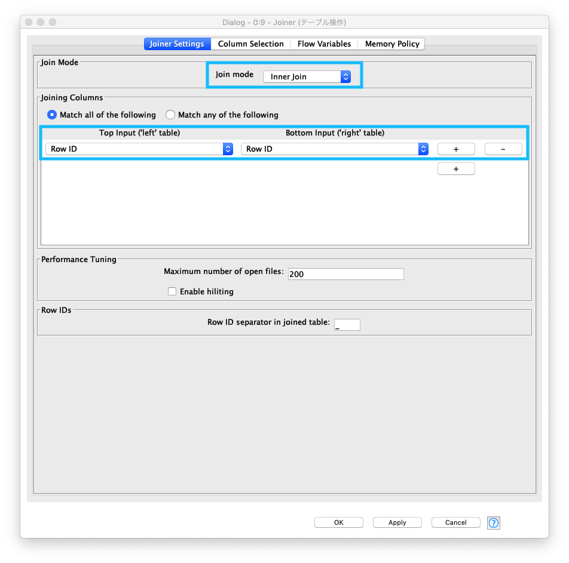

* `right table` には、次の3カラムを指定する *(重複するカラムを対象外にする)*
    * `mean (平均利用回数/月)`
    * `membership_period (会員期間)`
    * `Cluster (クラスター)`

*Fig. テーブル結合 / 設定 (2)*

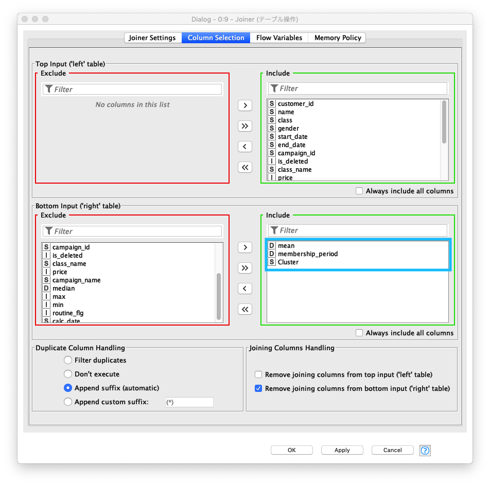

### 集計

集計の目的は、クラスター別 会員の行動の特徴を把握することです。このセクションでは、「クラスター別退会者集計」と「クラスター別定期利用者集計」を行います。

#### クラスター別退会者集計

* グループ化対象カラムに、`Cluster (クラスター)`、`is_deleted (途中退会者)` を指定し、**クラスター別退会者** を集計する
* 集計対象カラムは、`customer_id (会員ID)`とし、集計方法は `Count` を指定する
* 集計結果の着目点は以下の通り
    * `cluster_0` 退会者数 が最も多い
    * `cluster_1` 継続会員数 が二番目に多い

*Fig. 集計 / クラスター別退会者集計 / 設定 (1)*

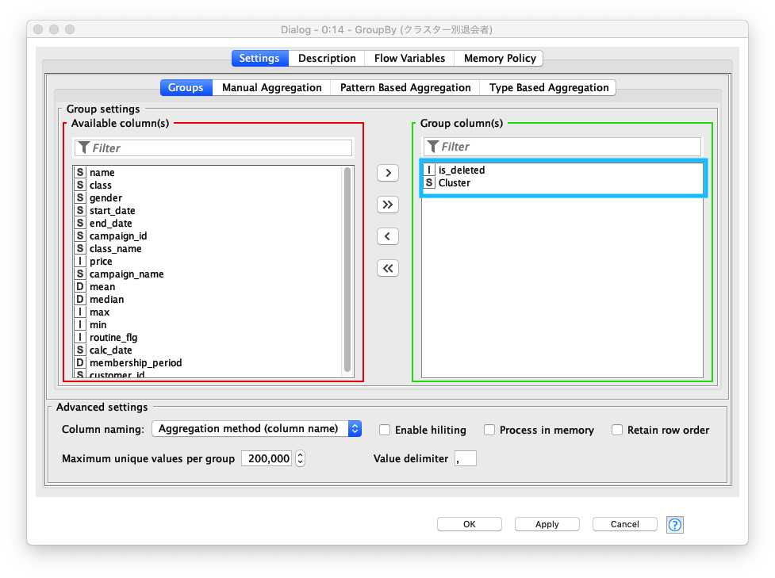

*Fig. 集計 / クラスター別退会者集計 / 設定 (2)*

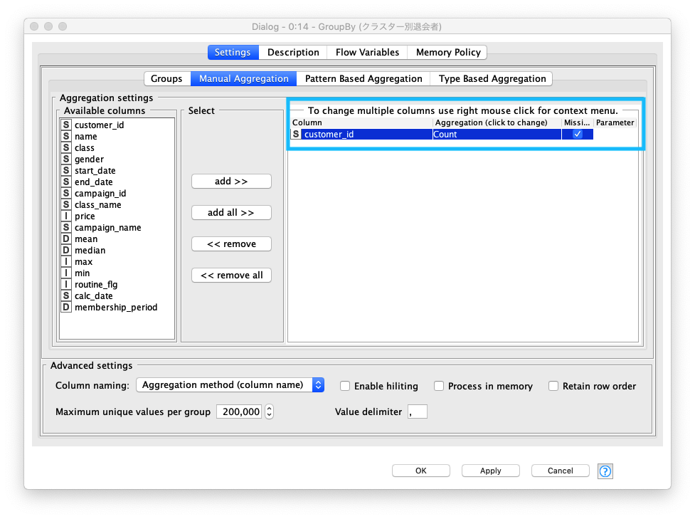

*Fig. 集計 / クラスター別退会者集計 / 結果テーブル*

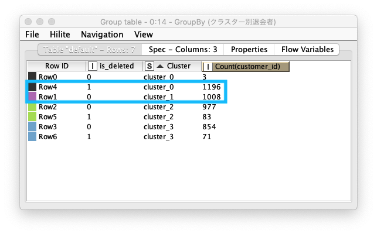

#### クラスター別定期利用者集計

* グループ化対象カラムに、`Cluster (クラスター)`、`routine_flg (定期利用フラグ)` を指定し、**クラスター別定期利用者** を集計する
* 集計対象カラムは、`customer_id (会員ID)`とし、集計方法は `Count` を指定する
* 集計結果の着目点は以下の通り
    * `cluster_2` 定期利用者数 が最も多い
    * `cluster_1` 定期利用者数 が二番目に多い

*Fig. 集計 / クラスター別定期利用者集計 / 設定 (1)*

*Fig. 集計 / クラスター別定期利用者集計 / 設定 (2)*

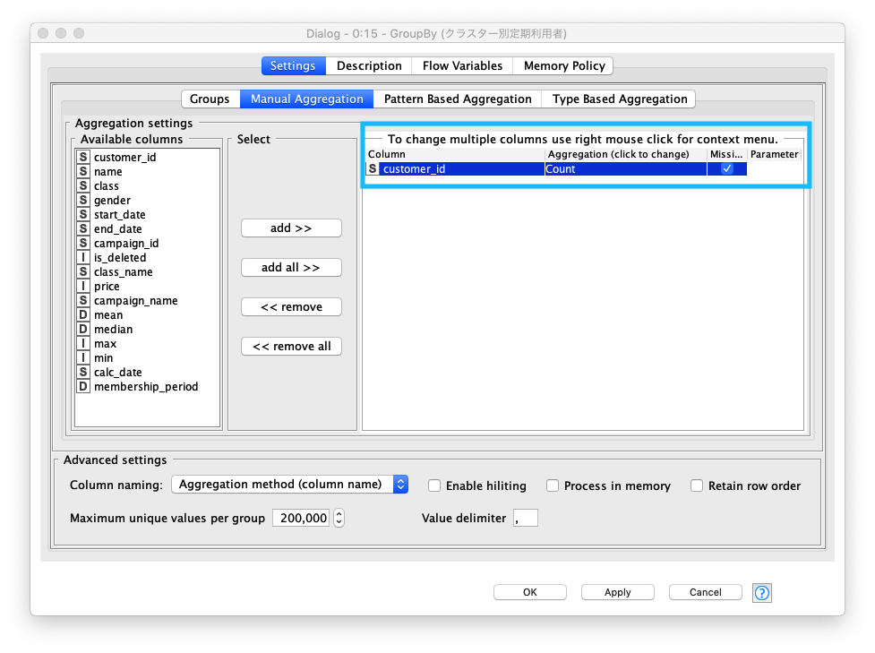

*Fig. 集計 / クラスター別定期利用者集計 / 結果テーブル*

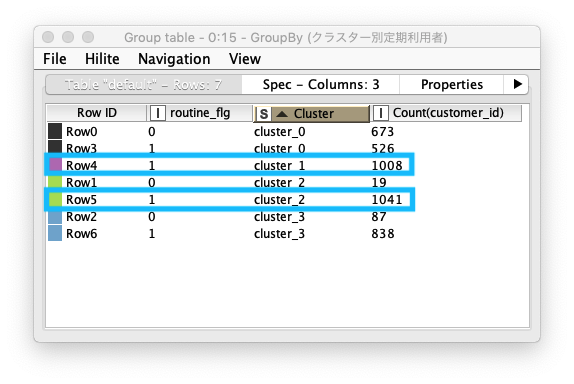

* 利用ノード: [Nodes / Manipulation / RowRow / Transform / GroupBy](https://nodepit.com/node/org.knime.base.node.preproc.groupby.GroupByNodeFactory)

### 可視化

データの中にあるカテゴリー同士の類似性や関係を理解するため、チャートをいくつか作成しデータの理解を深めます。次の三種類のチャートを作成します。

1. Parallel Coordinates Plot *(平行座標)*
2. Scatter Plot / 2D/3D Scatterplot *(散布図)*
3. Conditional Box Plot *(箱ひげ図)*

#### 1. Parallel Coordinates Plot

* Parallel Coordinates Plot *(平行座標)* を作成するのに必要な列、`mean (平均利用回数/月)`、`membership_period (会員期間)`、`Cluster (クラスター)` を指定する
* 各列の関係 - `mean (平均利用回数/月)` => `membership_period (会員期間)` => `Cluster (クラスター)` を確認する

*Fig. 可視化 / Parallel Coordinates Plot / 設定*

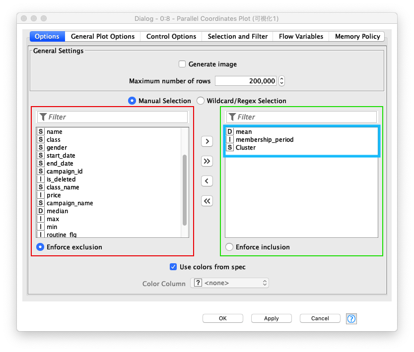

*Fig. 可視化 / Parallel Coordinates Plot / 結果*

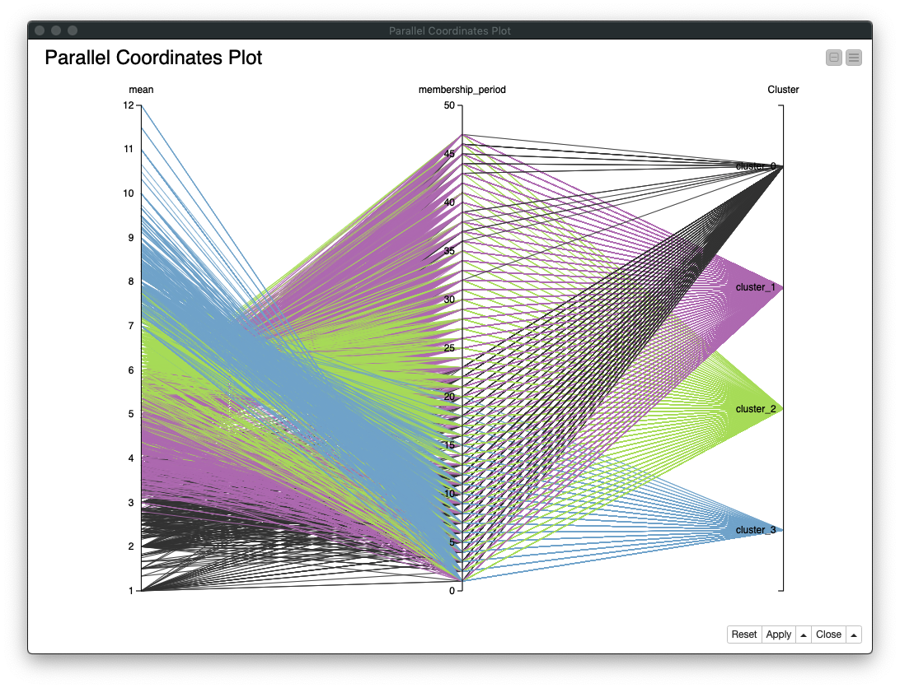

* 利用ノード: [Nodes / Views / JavaScript / Parallel Coordinates Plot](https://nodepit.com/node/org.knime.dynamic.js.v30.DynamicJSNodeFactory%23Parallel%20Coordinates%20Plot)

#### 2-1. Scatter Plot (1)

* X軸に `membership_period (会員期間)`、Y軸に `mean (平均利用回数/月)` を指定する
* 各クラスターが色分けされプロットされていることがわかり、綺麗に4つのクラスターができていることを確認し、各クラスターの `membership_period (会員期間)`と`mean (平均利用回数/月)`の関係も確認する

*Fig. 可視化 / Scatter Plot (1) / 設定*

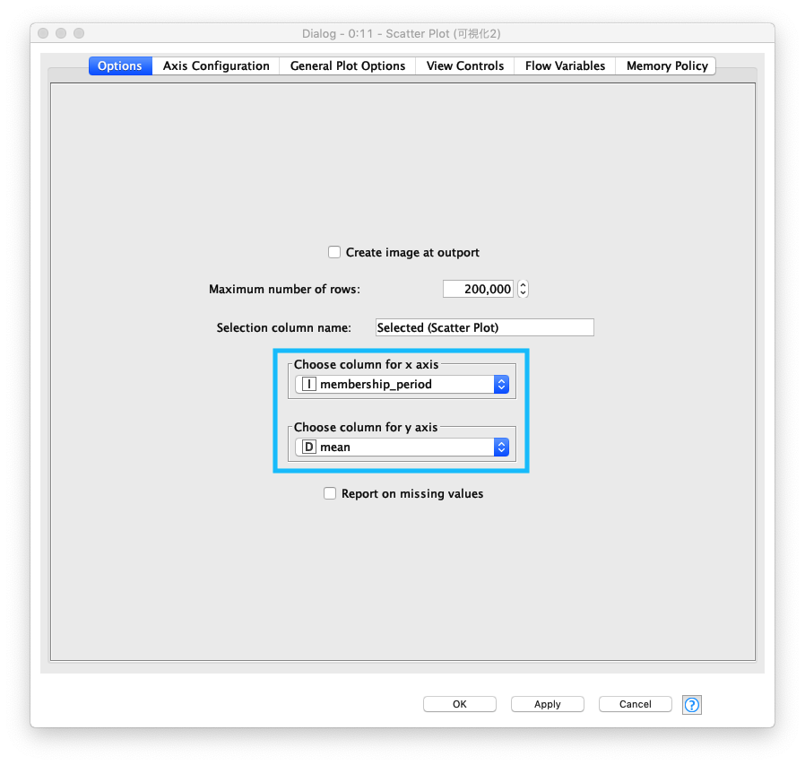

*Fig. 可視化 / Scatter Plot (1) / 結果*

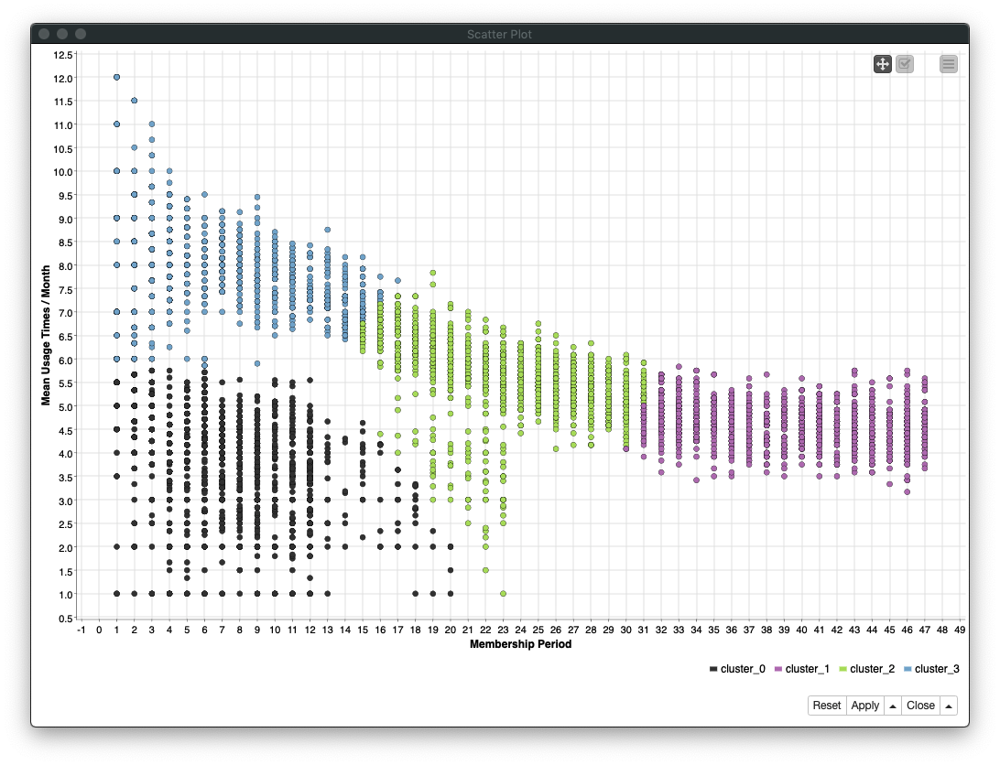

* 利用ノード: [Nodes / Views / JavaScript / Scatter Plot](https://nodepit.com/node/org.knime.js.base.node.viz.plotter.scatterSelectionAppender.ScatterPlotNodeFactory)

#### 2-2. Scatter Plot (2)

* 「2-1. Scatter Plot (1)」と同じ

*Fig. 可視化 / Scatter Plot (2) / 設定*

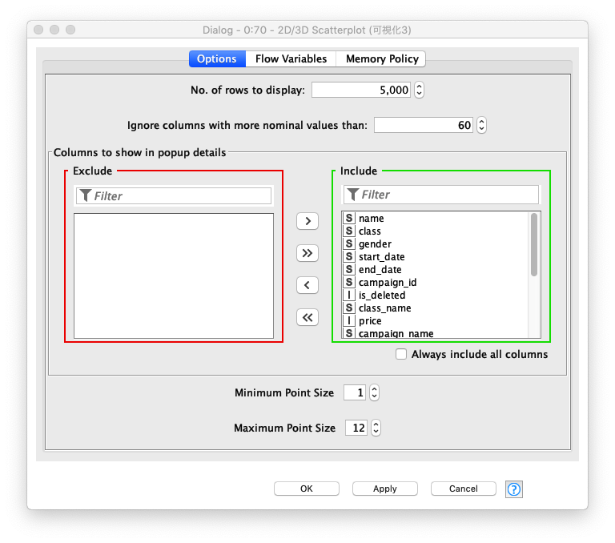

*Fig. 可視化 / Scatter Plot (2) / 結果*

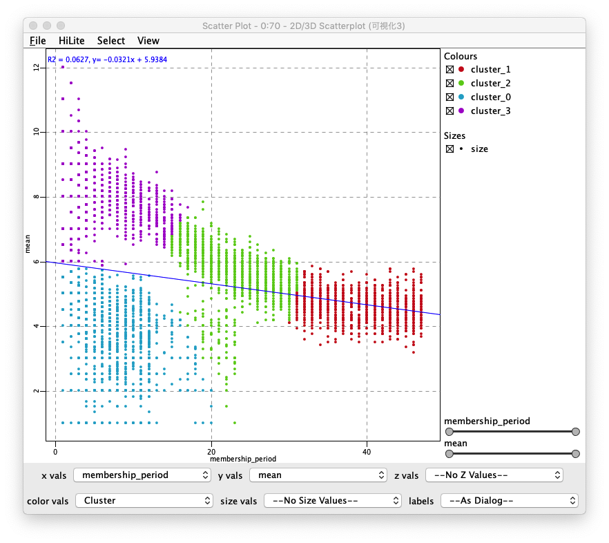

* 利用ノード: [Nodes / Community Nodes / Erlwood Nodes / Viewers](https://nodepit.com/node/org.erlwood.knime.nodes.graph.NGraphNodeFactory)

#### 3. Conditional Box Plot

* Box Plot *(箱ひげ図)* を作成し、各クラスターの `membership_period (会員期間)` と `mean (平均利用回数/月)` の**データのばらつき**を確認する
* `Category column` に `Cluster (クラスター)` を指定、対象カラムに `membership_period (会員期間)` と `mean (平均利用回数/月)` を指定する

*Fig. 可視化 / Conditional Box Plot / 設定*

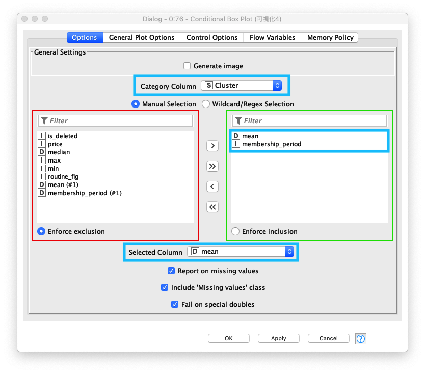

*Fig. 可視化 / Conditional Box Plot / クラスター別平均利用回数/月*

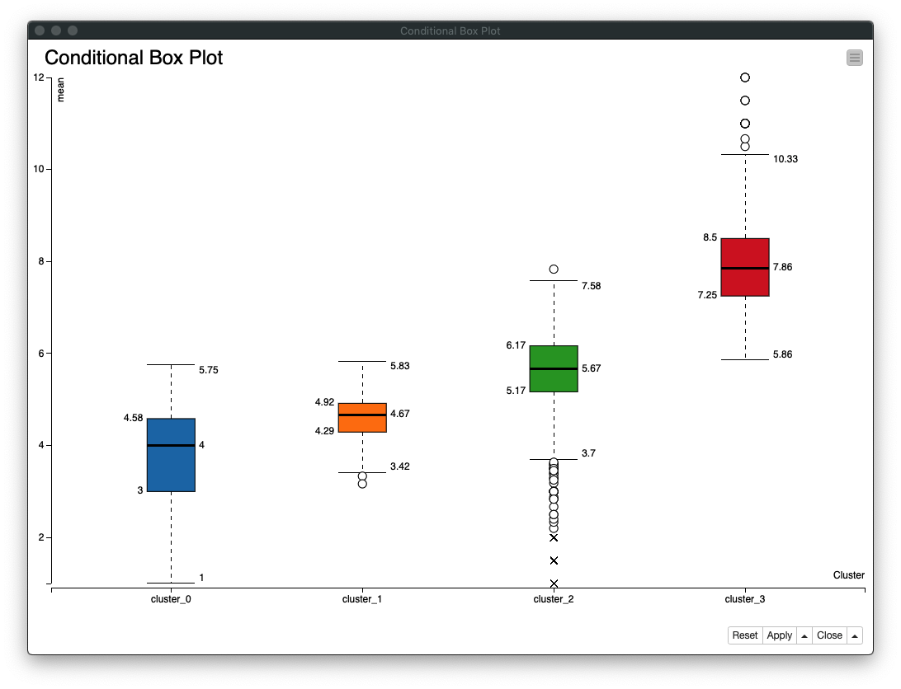

*Fig. 可視化 / Conditional Box Plot / クラスター別会員期間*

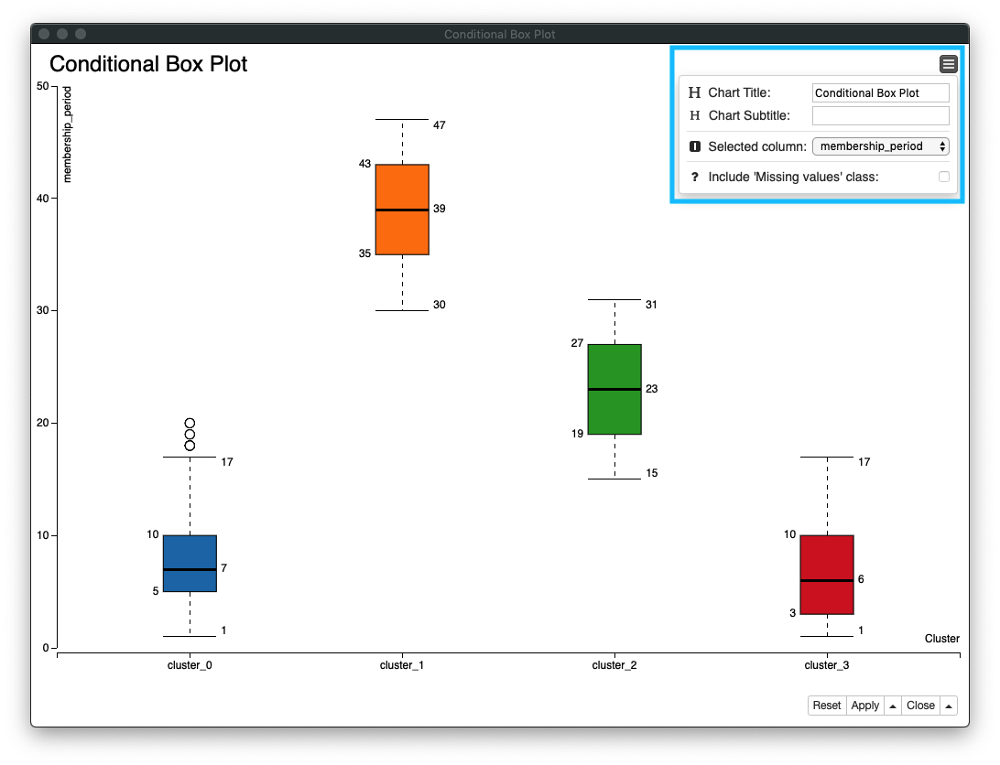

* 利用ノード: [Nodes / Views / JavaScript / Conditional Box Plot](https://nodepit.com/node/org.knime.dynamic.js.v30.DynamicJSNodeFactory%23Conditional%20Box%20Plot)

## まとめ

データ分析の初期の段階でクラスタリングを行いサンプルをグループ化することで、より直感的にデータの特徴をつかむことができました。この分析結果を参考にして、会員の利用回数の予測、退会予測 等をすることができます。

また、データに不具合さえなければ、KNIMEには、既存のクラスタリングノード - K-Means があるので、短時間でクラスタリングを行うことができます。

## Appendix / 利用ノード一覧

* [IO / Read / CSV Reader](https://nodepit.com/node/org.knime.base.node.io.csvreader.CSVReaderNodeFactory)
* [Nodes / KNIME Labs / JavaScript Views (Labs) / Data Explorer](https://nodepit.com/node/org.knime.base.node.stats.dataexplorer.DataExplorerNodeFactory)
* [Nodes / Manipulation / Column / Transform](https://nodepit.com/node/org.knime.base.node.preproc.normalize3.Normalizer3NodeFactory)
* [Workflows / KNIME Hub / Users / taka / Public / k-means](https://nodepit.com/workflow/com.knime.hub%2FUsers%2Ftaka%2FPublic%2Fclustering(k-means))
* [Nodes / Views / Property / Color Manager](https://nodepit.com/node/org.knime.base.node.viz.property.color.ColorManager2NodeFactory)
* [Nodes / Manipulation / RowRow / Transform / GroupBy](https://nodepit.com/node/org.knime.base.node.preproc.groupby.GroupByNodeFactory)
* [Nodes / Views / JavaScript / Parallel Coordinates Plot](https://nodepit.com/node/org.knime.dynamic.js.v30.DynamicJSNodeFactory%23Parallel%20Coordinates%20Plot)
* [Nodes / Views / JavaScript / Scatter Plot](https://nodepit.com/node/org.knime.js.base.node.viz.plotter.scatterSelectionAppender.ScatterPlotNodeFactory)
* [Nodes / Community Nodes / Erlwood Nodes / Viewers](https://nodepit.com/node/org.erlwood.knime.nodes.graph.NGraphNodeFactory)
* [Nodes / Views / JavaScript / Conditional Box Plot](https://nodepit.com/node/org.knime.dynamic.js.v30.DynamicJSNodeFactory%23Conditional%20Box%20Plot)

