# KNIME 実践編 / 解約予測

* 初版作成日: 2020-04-30
* 最終更新日: 2020-05-12

今回は、実践編の第一回目として、 <a href="https://www.kaggle.com/pavanraj159/telecom-customer-churn-prediction" target="_blank">Kaggle / Telecom Customer Churn Prediction (電話会社 顧客 解約予測)</a> のデータを使って複数の予測モデルを実装し、精度を比較します。

データの前処理から始まり、その後複数のモデル作成とモデル評価を行います。最後に4つのモデルの精度を比較します。次の4モデルを利用し解約予測を実装します。

1. Decision Tree *(決定木)*
2. Logistic Regression *(ロジスティック回帰)*
3. Random Forrest *(ランダムフォレスト)*
4. Multi Layer Perceptron *(多層パーセプトロン)*

 

## ワークフロー全体

KNIMEで実装するワークフローを二つのパートに分けて管理しています。

1. データ読み込み + 前処理
2. モデル作成 + モデル評価

KNIMEの最大の長所は、ワークフローを見ただけで全体の処理の流れの俯瞰することができることです。また、各モデルの実装 *(Modeling)* を **メタノード** にすることで、メインのワークフローをより理解し易くすることが可能です。

*Fig. 全体ワークフロー*

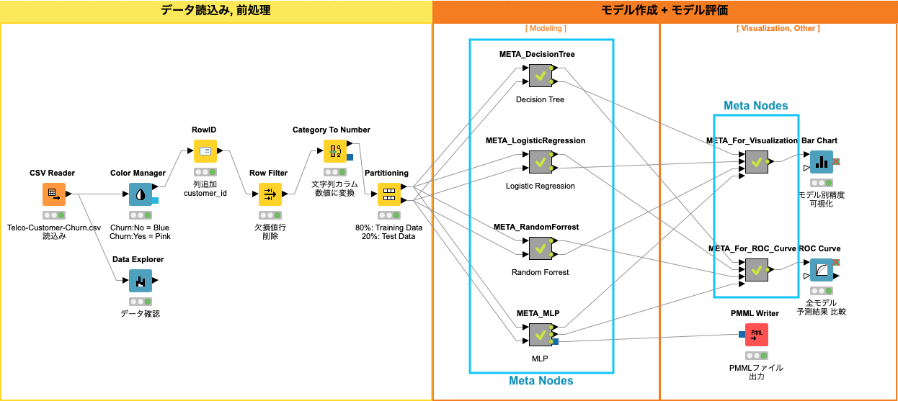

 

## 分析用データ読み込み, 前処理

このワークフロー パートでは、<a href="https://www.kaggle.com/pavanraj159/telecom-customer-churn-prediction" target="_blank">Kaggle / Telecom Customer Churn Prediction (電話会社 顧客 解約予測)</a> からダウンロードしたデータをKNIMEにロードし、その後前処理を実行します。

前処理では、データ確認後、判別クラス カラムの色設定、いくつかのデータ処理を経た後に、サンプル *(データ)* をトレーニングデータとテストデータに分割します。

*Fig. 分析用データ読み込み, 前処理 ワークフロー*

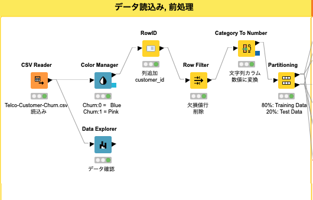

 

### 分析用データ読み込み

<a href="https://www.kaggle.com/pavanraj159/telecom-customer-churn-prediction" target="_blank">Kaggle / Telecom Customer Churn Prediction (電話会社 顧客 解約予測)</a> からダウンロードしたデータをKNIMEにロードします。**CSV Readerノード** の設定で 特に気をつける箇所は、 以下の３点です。

1. CSVファイルの文字コードが <a href="https://en.wikipedia.org/wiki/UTF-8" target="_blank">UTF-8</a> であること
2. 行見出しの存在有無 *(Has Row Header)*
3. デリミター文字 *(Column Delimiter)*

*Fig. 分析用データ読み込み/設定*

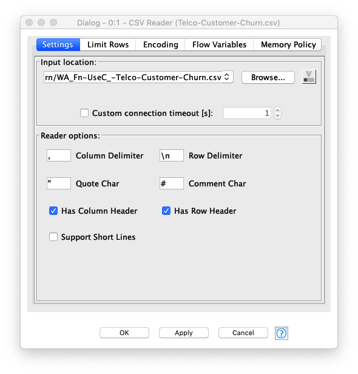

* 利用ノード: [IO / Read / CSV Reader](https://nodepit.com/node/org.knime.base.node.io.csvreader.CSVReaderNodeFactory)

 

### データ確認

<a href="https://nodepit.com/node/org.knime.base.node.stats.dataexplorer.DataExplorerNodeFactory" target="_blank">Data Explorerノード</a>を利用して、サンプルの各カラムの分布を確認します。**Numericタブ** で数値カラムの統計情報とチャート が出力されます。*(Fig. データ確認 (1), Fig. データ確認 (2))*

一方、数値以外のカラムに関しては、**Nominalタブ** に各カラムの情報が出力されます。これらの情報からサンプルの特徴を把握します。*(Fig. データ確認 (3))*

*Fig. データ確認 (1)*

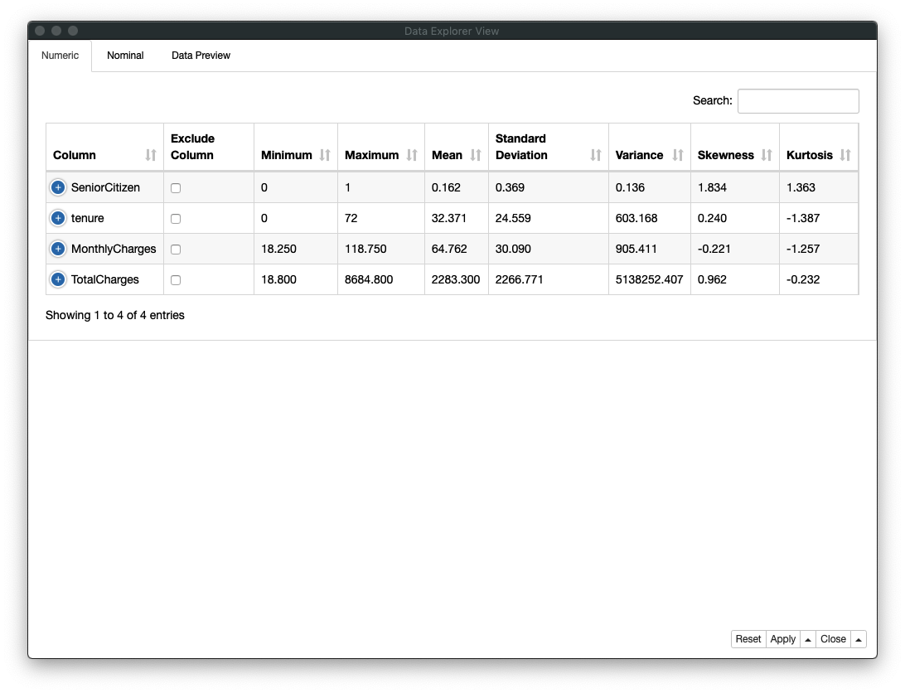

<u>tenure *(継続期間)*</u> の分布を確認します。平均 継続期間が 32.371ヶ月、0-7ヶ月の範囲に会員数が最も多く、次に多いのが 65-72ヶ月であることがわかります。0-7ヶ月以後、 会員の約半数が解約していることがわかります。以上から tenure *(継続期間)* が 解約/継続を判別する重要なデータであると言えます。

*Fig. データ確認 (2)*

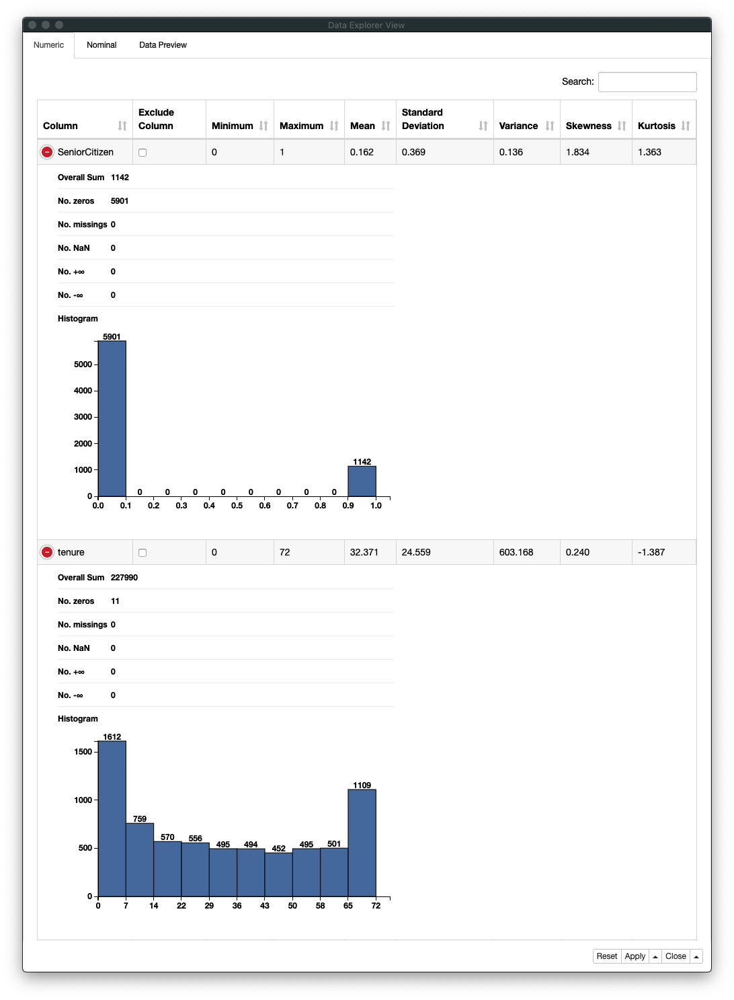

数値以外のカラムのデータは、Nominalタブ内に出力される各カラムの情報 - <u>欠損値数 *(No. missings)*</u>、<u>ユニークな値の数</u>、<u>値のリスト</u>、<u>データの分布</u> を確認します。

*Fig. データ確認 (3)*

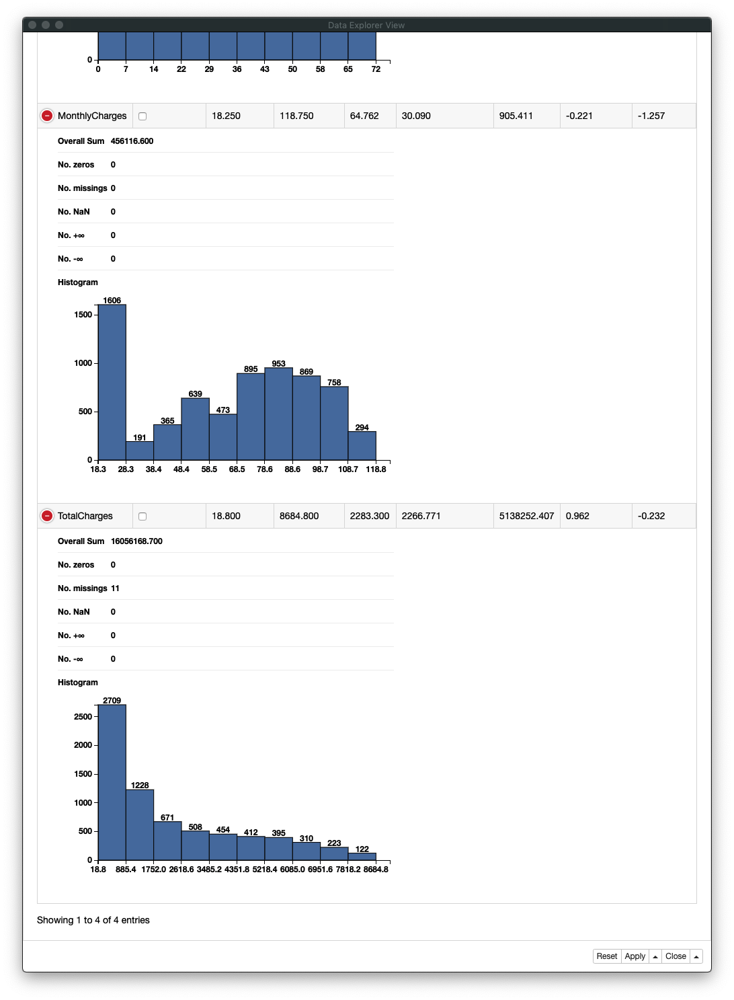

* 利用ノード: [Nodes / KNIME Labs / JavaScript Views (Labs) / Data Explorer](https://nodepit.com/node/org.knime.base.node.stats.dataexplorer.DataExplorerNodeFactory)

 

### 色識別設定

判別対象のカラムの値を識別し易くする為、<a href="" target="_blank">Color Managerノード</a> を利用します。Churnカラムの値、`No` と `Yes` に色を指定します。

*Fig. 継続/解約 色設定*

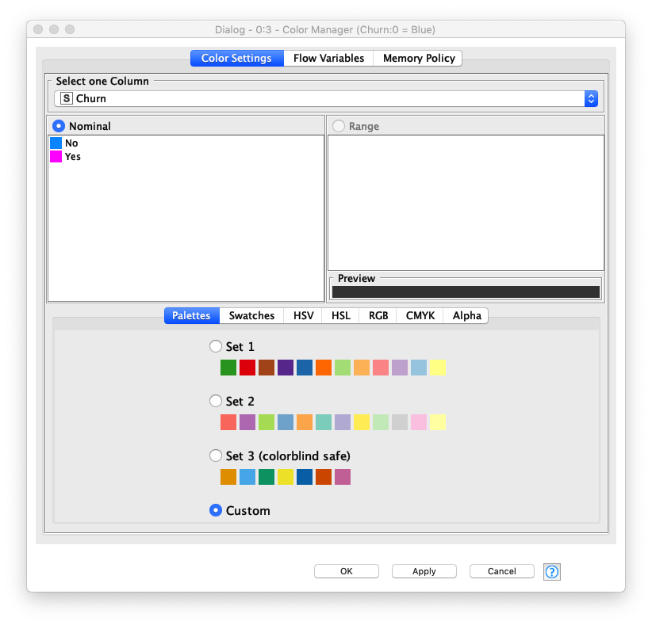

* 利用ノード: [Nodes / Views / Property / Color Manager](https://nodepit.com/node/org.knime.base.node.viz.property.color.ColorManager2NodeFactory)

 

### 欠損値含む行削除

欠損値数が少ない為 *(総行数:7043件, 欠損値行数11件)*、この演習では欠損値を含むデータを削除します。

*Fig. 欠損値 設定*

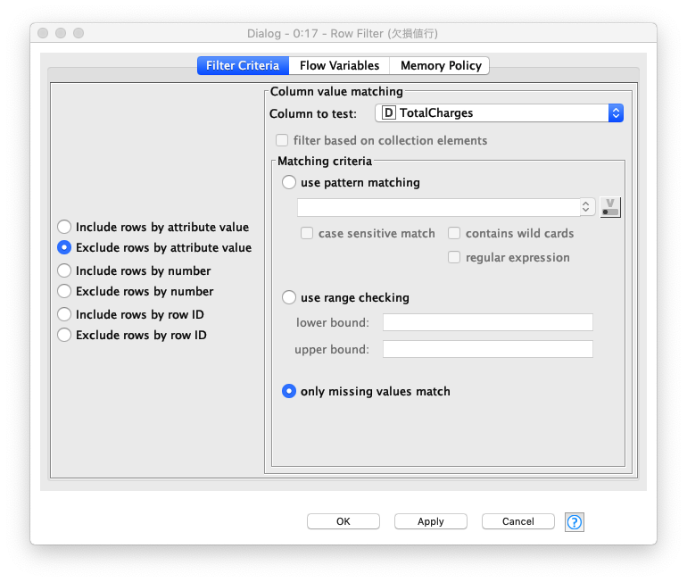

* 利用ノード: [Nodes / Manipulation / Row / Filter / Row Filter](https://nodepit.com/node/org.knime.base.node.preproc.filter.row.RowFilterNodeFactory)

 

### 文字列カラムの数値変換

モデル構築時に扱うデータは数値型が要求される為、文字列を値にもつカラムのデータを数値型に変換します。対象とするカラムは、次の4カラムです。

* InternetService
* OnlineSecurity
* TechSupport
* Contract

*Fig. 文字列カラム 数値変換 / 設定*

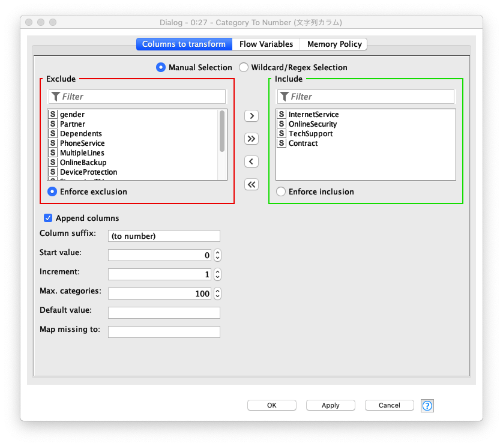

* 利用ノード: [Nodes / Manipulation / Column / Convert & Replace](https://nodepit.com/node/org.knime.base.node.preproc.colconvert.categorytonumber2.CategoryToNumberNodeFactory2)

 

### テーブル分割

*Fig. テーブル分割 / 設定*

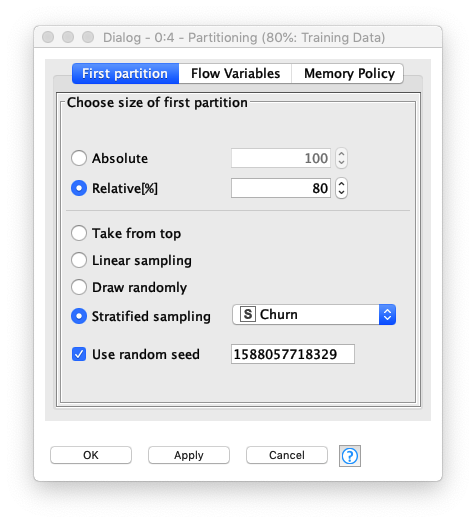

入力テーブルは2つのパーティション *(トレーニング用とテスト用)* に分割されます。 それぞれのパーティションには、出力ポートが存在するので、このノードの後ろに繋がるノードは、分割されたテーブルを利用することになります。今回の演習では、**トレーニング用レコード と テスト用レコードの割合を 「80% : 20%」に設定**しています。

* 利用ノード: [Nodes / Manipulation / Row / Transform / Partitioning](https://nodepit.com/node/org.knime.base.node.preproc.partition.PartitionNodeFactory)

 

## モデル作成, モデル評価 (4モデル)

*Fig. モデル作成, モデル評価 ワークフロー*

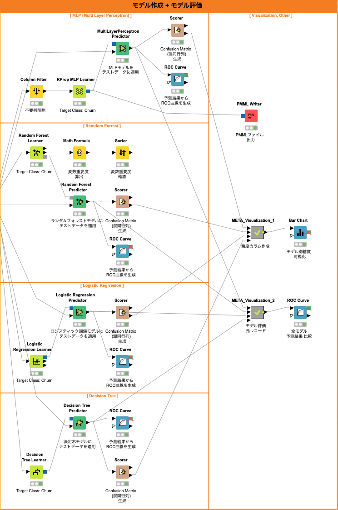

 

### 1. Decision Tree (決定木)

Decision Tree *(決定木)* は、回帰分析、クラス分類に利用されます。回帰モデル、クラス分類モデルが Tree(木)構造のため、モデルを直感的に理解することができます。その反面、このモデルの精度は他の高度なモデルよりも精度が落ちる事が多いと言われています。

*Fig. Decision Tree ワークフロー*

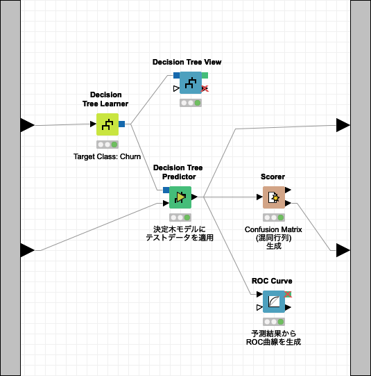

#### **学習**

Decision Tree Learningノードの設定画面で、以下の6つの項目を設定します。データの特徴、分析内容に従って これらの設定を行う必要があります。

| 項目 | 説明 | 設定|
| ---- | ---- | ---- |
| 1. Class column | 分類対象クラスのカラム名 | Churn *(解約/継続カラム)* |
| 2. Quality measure | データ分割手法: - `Gini Index` - `Gain Ratio`| Gini Index [^1] |
| 3. Pruning method | 剪定有無: - `MDL (最小記述長)` - 過学習抑止 - `No pruning (無剪定)` | MDL [^2] |
| 4. Reduced Error Pruning | 単純な剪定方法を使用、剪定エラーの削減には単純さと速度の利点がある | ON |
| 5. Min number records per node | 各ノードで最低限必要なレコードの最小数を指定する  レコード数がこの指定値以下の場合、ツリーはそれ以上大きくならない | 2 |
| 6. Average split point | - `ON`: 数値属性の分割値は、2つのパーティションを分離する2つの属性値の平均値に従って決定される  - `OFF`: 分割値は下位パーティションの最大値に設定される |  ON |

*Fig. Decision Tree / 学習.設定*

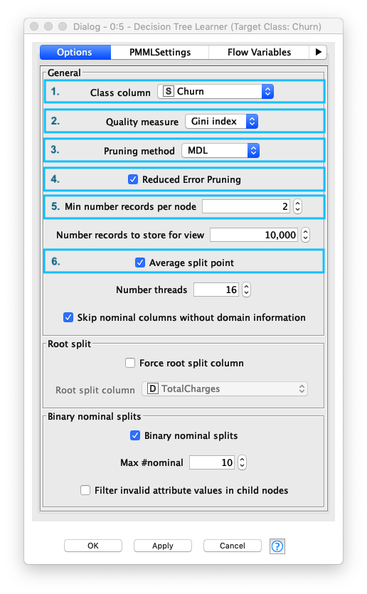

Decision Tree Learnerノードの実行結果を確認することで、生成された Decision Tree(決定木) を確認できます。Decision Treeは、二分木構造であり、根から葉に向かって順番に条件分岐を辿ることで最終的な結果を返すことがわかります。図を見ると、*ROOT 〜 Contract 〜 InternetService 〜 tenure ...*  - Decision Tree *(決定木)* が構築されていることがわかります。

*Fig. Decision Tree / 学習.結果*

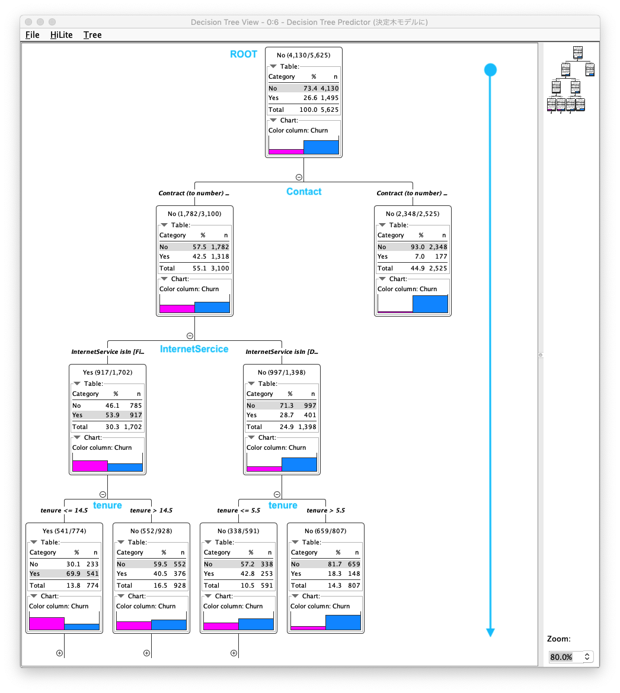

#### **予測**

Decision Tree Predictorノードの設定は、**Append columns with normalized class distribution** *(正規化されたクラス分布で列を追加する)* を "ON" にすることで、各予測の正規化されたクラス分布を表示します。 

*Fig. Decision Tree / 予測.設定*

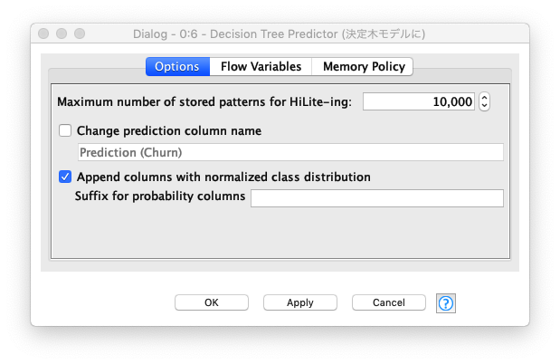

既存のテーブルに 以下の3カラムが追加されていることを確認します。次のステップでは、継続/退会 の判別精度を評価します。

* P (Churn = No) : `Churn = No` の割合
* P (Churn = Yes) : `Churn = Yes` の割合
* Prediction (Churn) : 予測結果

*Fig. Decision Tree / 予測.結果*

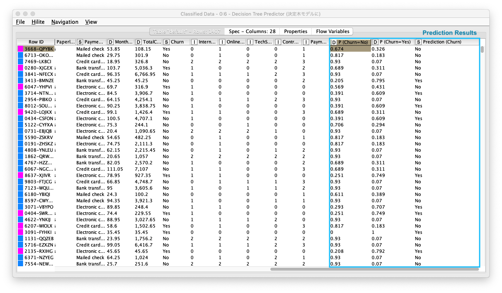

#### **評価 (1)**

継続/退会 の判別精度を評価するため、次の通り Sorerノード を設定します。

* First Column *(データの実クラス)* : `Churn`
* Second Column *(データの予測クラス)* : `Prediction (Churn)`

*Fig. Decision Tree / 評価(1).設定*

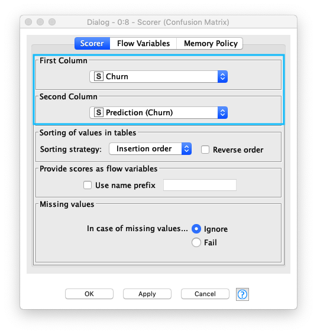

Scorerノードを実行すると **Confusion Matix** *(混同行列)* をテーブル形式で表示します。また、**Accuracy Statistics (下図参照)** *(精度統計)* を表示することで、詳細な精度を確認することができます。

* Accuracy *(精度)* : 0.802
* Kohen's Kappa *(カッパ係数)*  [^3] : 0.446

*Fig. Decision Tree / 評価(1).結果*

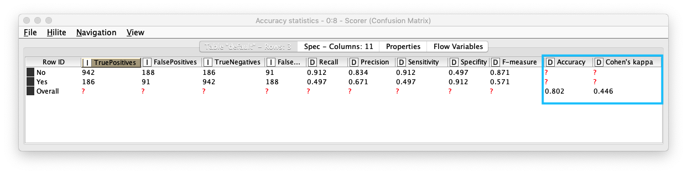

Accuracy *(精度)*, Kohen's Kappa *(カッパ係数)* 共に 1.0に近づくほど精度が高いとされています。カッパ係数の基準 *(Landis and Koch 基準)* は以下の通りです。

**Landis and Koch 基準:**

| カッパ係数 範囲 | 解釈 |
|:----:|----|
| 0.00  - 0.20 | わずかに一致 *(slight agreement)* |
| 0.21 - 0.40 | まずまずの一致 *(fair agreement)* |
| 0.41 - 0.60 | 中等度の一致 *(moderate agreement)* |
| 0.61 - 0.80 | かなりの一致 *(substantial agreement)* |
| 0.81 - 1.00 | ほぼ完全、完全一致 *(almost perfect or perfect agreement)* |

#### **評価 (2)**

ROC *(Receiver Operating Characteristic)* Curve *(ROC曲線)* は、二値分類の評価で使われます。Y軸にTPR *(True Positive Rate - 真陽性率)*、X軸に FPR *(False Positive Rate - 偽陽性立)* の割合をプロットします。AUC *(Area Under the Curve)* は、その曲線の下部の面のことであり、AUC の面積が大きいほどモデルの性能が良いとされています。

以下の通り ROC Curveノード を設定します

* Class column : Churn
* Positive class value : No
* Columns containing the positive class probablities : P (Chuen = No)

*Fig. Decision Tree / 評価(2).設定*

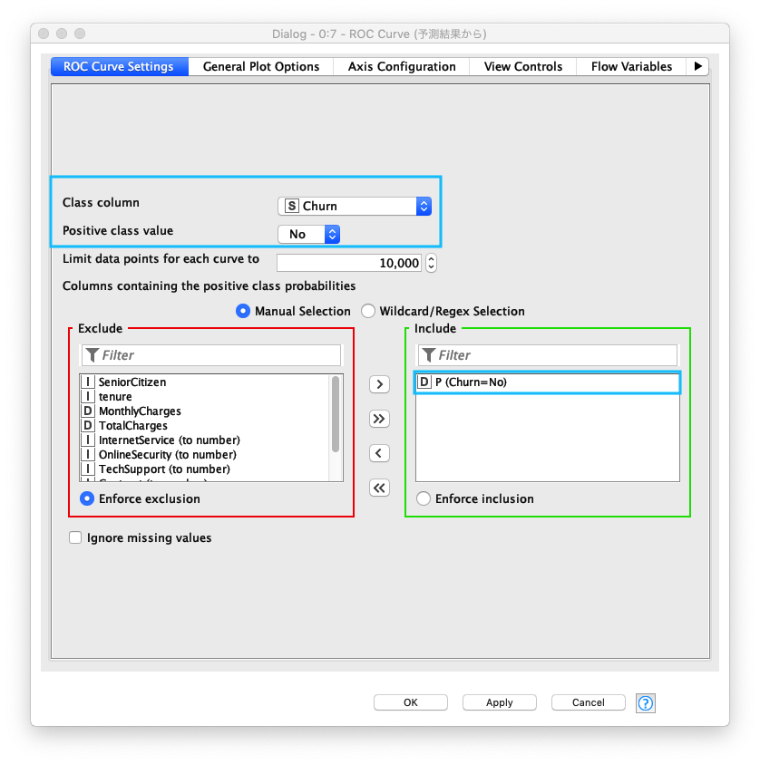

ROC Curveノード の実行結果は、次の通り **「AUC: 0.823」** であることがわかります

*Fig. Decision Tree / 評価(2).結果 - ROC曲線*

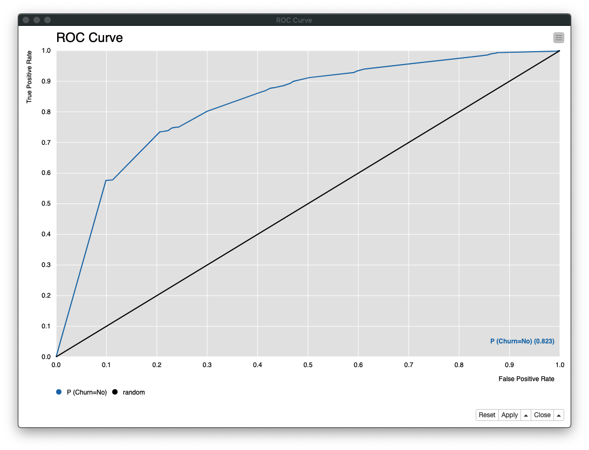

*Fig. Decision Tree / 評価(2).結果 - AUC*

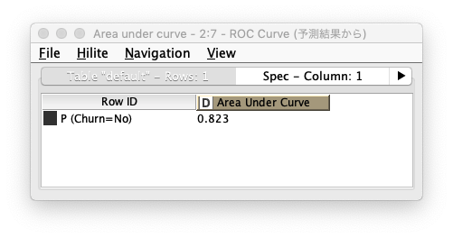

 

### 2. Logistic Regression (ロジスティック回帰)

*Fig. Logistic Regression ワークフロー*

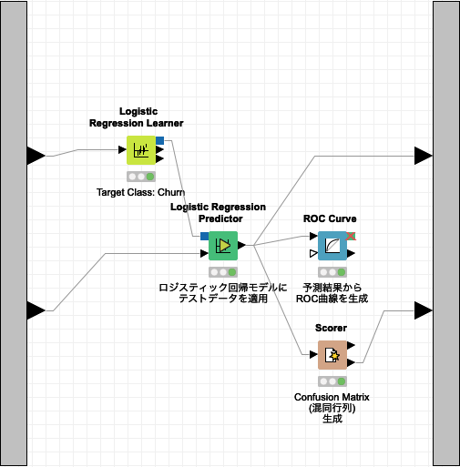

### 3. Random Forrest (ランダムフォレスト)

*Fig. Random Forrest ワークフロー*

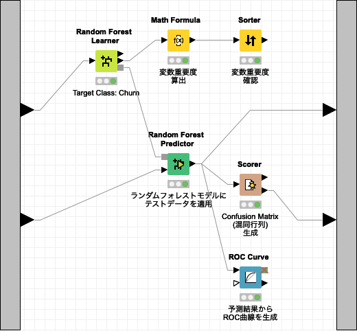

### 4. Multi Layer Perceptron (多層パセプトロン)

*Fig. Multi Layer Perceptron ワークフロー*

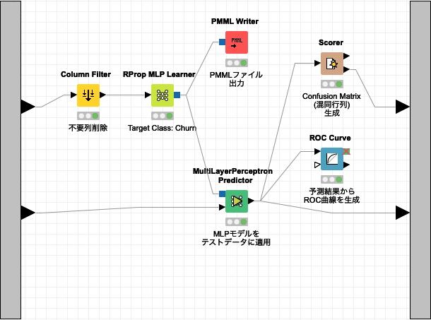

## 利用ノード一覧
### 前処理

* [IO / Read / CSV Reader](https://nodepit.com/node/org.knime.base.node.io.csvreader.CSVReaderNodeFactory)
* [Nodes / KNIME Labs / JavaScript Views (Labs) / Data Explorer](https://nodepit.com/node/org.knime.base.node.stats.dataexplorer.DataExplorerNodeFactory)
* [Nodes / Views / Property / Color Manager](https://nodepit.com/node/org.knime.base.node.viz.property.color.ColorManager2NodeFactory)
* [Nodes / Manipulation / Row / Filter / Row Filter](https://nodepit.com/node/org.knime.base.node.preproc.filter.row.RowFilterNodeFactory)
* [Nodes / Manipulation / Column / Convert & Replace](https://nodepit.com/node/org.knime.base.node.preproc.colconvert.categorytonumber2.CategoryToNumberNodeFactory2)
* [Nodes / Manipulation / Row / Transform / Partitioning](https://nodepit.com/node/org.knime.base.node.preproc.partition.PartitionNodeFactory)

### モデル作成 + モデル評価

[^1]: <a href="https://ja.wikipedia.org/wiki/ジニ係数" target="_blank">Gini Index *(ジニ係数)*</a>
[^2]: <a href="https://ja.wikipedia.org/wiki/最小記述長" target="_blank"> MDL *(最小記述長)*</a>
[^3]: <a href="https://en.wikipedia.org/wiki/Cohen%27s_kappa" target="_blank"> Kohen's Kappa *(カッパ係数)*</a>